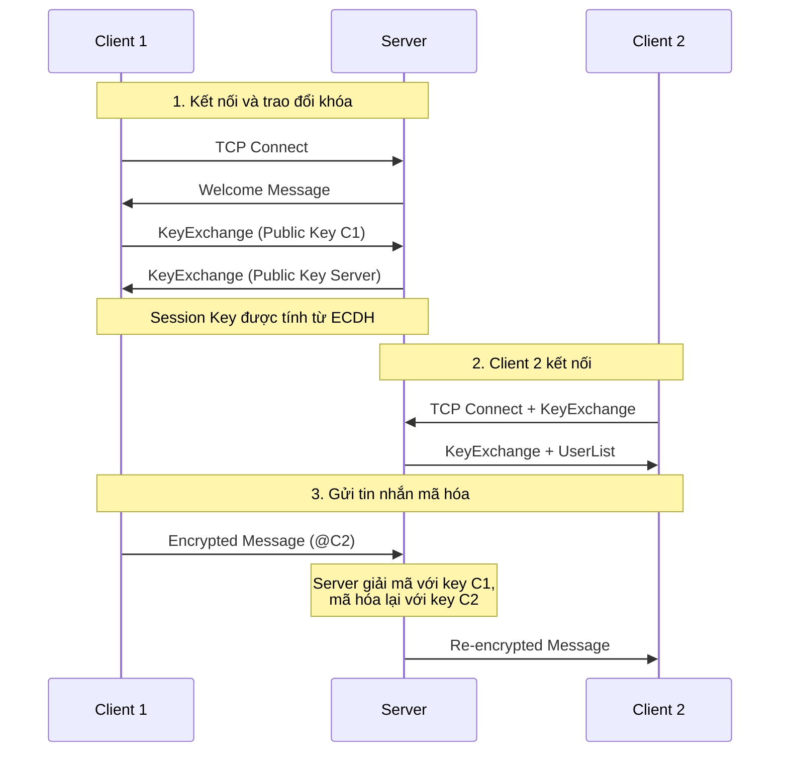
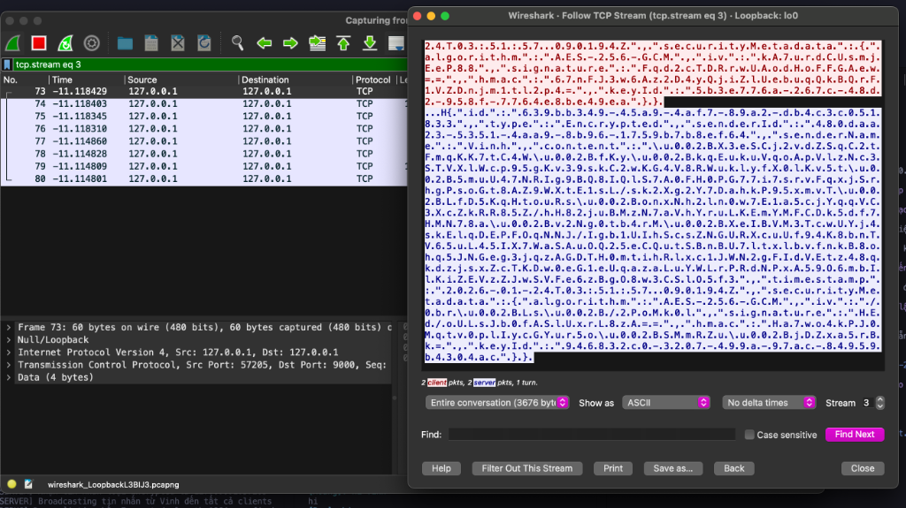

# SecureChat-System

Ứng dụng chat client-server bảo mật với mã hóa end-to-end sử dụng các thuật toán mật mã hiện đại cho môn học mạng máy tính.

## Tính năng bảo mật

- **ECDH Key Exchange (P-256)**: Trao đổi khóa Diffie-Hellman trên đường cong elliptic
- **AES-256-GCM**: Mã hóa tin nhắn với authenticated encryption
- **HMAC-SHA256**: Xác thực tính toàn vẹn tin nhắn
- **HKDF**: Key derivation function để tạo session keys

## Nguyên lý hoạt động

### 1. Trao đổi khóa ECDH (Elliptic Curve Diffie-Hellman)

ECDH cho phép hai bên thiết lập một shared secret qua kênh không bảo mật mà không cần gửi secret đó trực tiếp.

```
┌─────────────────────────────────────────────────────────────────┐
│                    ECDH Key Exchange                            │
├─────────────────────────────────────────────────────────────────┤
│                                                                 │
│   Client                                    Server              │
│   ───────                                   ──────              │
│   Tạo private key: a                        Tạo private key: b  │
│   Tính public key: A = a × G                Tính public key: B = b × G │
│                                                                 │
│                     A (public key)                              │
│   ─────────────────────────────────────────────>                │
│                                                                 │
│                     B (public key)                              │
│   <─────────────────────────────────────────────                │
│                                                                 │
│   Shared Secret = a × B                     Shared Secret = b × A │
│              = a × (b × G)                              = b × (a × G) │
│              = ab × G                                   = ab × G │
│                                                                 │
│   ✓ Cả hai đều có cùng shared secret mà không truyền nó!       │
└─────────────────────────────────────────────────────────────────┘
```

**G** là điểm generator trên đường cong P-256, được chuẩn hóa bởi NIST.

### 2. Key Derivation với HKDF

Từ shared secret, chúng ta derive ra 2 khóa riêng biệt:

```
Shared Secret (32 bytes)
        │
        ▼
   ┌─────────┐
   │  HKDF   │  (HMAC-based Key Derivation Function)
   │ SHA-256 │
   └────┬────┘
        │
   ┌────┴────┐
   ▼         ▼
┌──────┐  ┌──────┐
│ Key1 │  │ Key2 │
│ 32B  │  │ 32B  │
└──────┘  └──────┘
    │         │
    ▼         ▼
Encryption  MAC Key
   Key     (HMAC)
(AES-256)
```

### 3. Mã hóa tin nhắn với AES-256-GCM

AES-GCM (Galois/Counter Mode) cung cấp cả **confidentiality** và **integrity**:

```
┌─────────────────────────────────────────────────────────────────┐
│                     AES-256-GCM Encryption                      │
├─────────────────────────────────────────────────────────────────┤
│                                                                 │
│   Plaintext   +   Key   +   IV (12 bytes)                      │
│       │           │          │                                  │
│       ▼           ▼          ▼                                  │
│   ┌─────────────────────────────────┐                          │
│   │          AES-256-GCM            │                          │
│   └─────────────────────────────────┘                          │
│                    │                                            │
│          ┌─────────┴─────────┐                                  │
│          ▼                   ▼                                  │
│     Ciphertext         Auth Tag                                 │
│    (encrypted)        (16 bytes)                                │
│                                                                 │
│   • IV: Random, unique cho mỗi tin nhắn                        │
│   • Auth Tag: Xác thực ciphertext chưa bị thay đổi             │
└─────────────────────────────────────────────────────────────────┘
```

### 4. Xác thực với HMAC-SHA256

Ngoài GCM tag, chúng ta thêm HMAC để double-check integrity:

```
Ciphertext ──────┐
                 ▼
              ┌──────────────┐
MAC Key ─────>│  HMAC-SHA256 │
              └──────────────┘
                     │
                     ▼
               HMAC (32 bytes)
```

**Verify-then-Decrypt**: Server kiểm tra HMAC trước khi giải mã để ngăn chặn các cuộc tấn công dựa trên lỗi giải mã.

### 5. Cấu trúc tin nhắn mã hóa

```json
{
  "id": "unique-message-id",
  "type": 4,  // Encrypted
  "senderId": "user-id",
  "senderName": "username",
  "content": "base64(ciphertext)",
  "securityMetadata": {
    "algorithm": "AES-256-GCM",
    "iv": "base64(12-byte-iv)",
    "signature": "base64(16-byte-auth-tag)",
    "hmac": "base64(32-byte-hmac)"
  }
}
```

### 6. Routing tin nhắn qua Server (E2E Encryption)

Tin nhắn trực tiếp giữa các clients sử dụng **mã hóa E2E thực sự** - server KHÔNG THỂ đọc được nội dung:

```
┌────────┐                    ┌────────┐                    ┌────────┐
│Client A│                    │ Server │                    │Client B│
└───┬────┘                    └───┬────┘                    └───┬────┘
    │                             │                             │
    │ ═══ 1. Peer Key Exchange ═══│═════════════════════════════│
    │  PeerKeyExchange(PubKey_A)  │                             │
    │────────────────────────────>│ ─────(forward)──────────────>│
    │                             │<───(PeerKeyExchangeResp)────│
    │<────────────────────────────│                             │
    │                             │                             │
    │ SharedSecret_AB = A × B                   SharedSecret_AB = B × A
    │                             │                             │
    │ ═══ 2. E2E Encrypted Chat ══│═════════════════════════════│
    │  Encrypt(msg, Key_AB)       │                             │
    │────────────────────────────>│ ─────(forward ONLY)─────────>│
    │                             │ ❌ Server KHÔNG THỂ đọc!    │ Decrypt(Key_AB)
```

> **Bảo mật E2E**: Server **KHÔNG THỂ** đọc nội dung tin nhắn trực tiếp. Tin nhắn được mã hóa trực tiếp giữa các clients với shared secret riêng.

## Luồng hoạt động



### Chi tiết luồng:

1. **Kết nối TCP**: Client kết nối đến server qua TCP port 9000
2. **Trao đổi khóa ECDH**: 
   - Client tạo cặp khóa ECDH (private/public)
   - Gửi public key đến server
   - Server gửi lại public key của mình
   - Cả hai bên tính shared secret và derive session keys
3. **Tin nhắn Join**: Client gửi tin nhắn join với username
4. **Nhận danh sách users**: Server gửi danh sách users online
5. **Gửi tin nhắn**:
   - **Broadcast**: Gửi đến tất cả users
   - **Direct message**: `@username nội dung` - chỉ gửi đến user cụ thể
6. **Mã hóa**: Mọi tin nhắn đều được mã hóa AES-256-GCM với HMAC

## Wireshark - Xác minh mã hóa

Ảnh dưới đây cho thấy traffic đã được mã hóa hoàn toàn khi capture bằng Wireshark. Không thể đọc được nội dung tin nhắn:



**Phân tích**:
- Dữ liệu hiển thị dạng binary/hex không thể đọc được
- Không có plaintext username hay nội dung tin nhắn
- Chứng minh AES-256-GCM đang hoạt động đúng

## Cấu trúc dự án

```
SecureChat-System/
├── SecureChat.sln                # Solution file
├── src/
│   ├── SecureChat.Core/          # Thư viện dùng chung
│   │   ├── Models/               # Message, User, MessageType
│   │   ├── Security/
│   │   │   ├── Interfaces/       # IKeyExchange, ISymmetricEncryption
│   │   │   └── Implementations/  # ECDH, AES-GCM, HMAC, HKDF
│   │   ├── Networking/           # Message serialization
│   │   └── Utilities/            # Logging, SecureRandom
│   │
│   ├── SecureChat.Server/        # TCP chat server
│   │   ├── ChatServer.cs         # Server chính, accept connections
│   │   ├── ClientHandler.cs      # Xử lý tin nhắn từng client
│   │   └── ClientManager.cs      # Quản lý clients, routing
│   │
│   └── SecureChat.Client/        # TCP chat client
│       ├── ChatClient.cs         # Chat operations cấp cao
│       └── ServerConnection.cs   # Quản lý kết nối TCP
│
├── docs/                         # Tài liệu chi tiết
│   ├── ARCHITECTURE.md
│   ├── CRYPTOGRAPHY.md
│   └── MESSAGE_PROTOCOL.md
│
└── tests/                        # Unit tests
```

## Hướng dẫn sử dụng

### Yêu cầu
- .NET 8.0 SDK trở lên

### Build
```bash
dotnet build SecureChat.sln
```

### Chạy Server
```bash
cd src/SecureChat.Server
dotnet run
# Hoặc với port tùy chỉnh:
dotnet run -- 8080
```

### Chạy Client
```bash
# Mở terminal mới
cd src/SecureChat.Client
dotnet run
```

### Sử dụng
1. Nhập tên của bạn khi được hỏi
2. Đợi kết nối và trao đổi khóa hoàn tất
3. Gõ tin nhắn và Enter để gửi (broadcast)
4. Gõ `@username tin nhắn` để gửi tin nhắn riêng
5. Gõ `/users` để xem danh sách users online
6. Ctrl+C để thoát

## Kiến trúc bảo mật

### Các thuật toán sử dụng

| Thành phần | Thuật toán | Mục đích |
|------------|-----------|----------|
| Key Exchange | ECDH P-256 | Thiết lập shared secret |
| Encryption | AES-256-GCM | Mã hóa tin nhắn |
| Authentication | HMAC-SHA256 | Xác thực tính toàn vẹn |
| Key Derivation | HKDF-SHA256 | Derive session keys |

### Các biện pháp bảo mật

- **Mã hóa đầu cuối**: Tin nhắn được mã hóa trước khi gửi
- **Ephemeral keys**: Mỗi phiên sử dụng khóa mới
- **Authenticated encryption**: AES-GCM đảm bảo cả confidentiality và integrity
- **Replay attack prevention**: Timestamps và message IDs
- **DoS prevention**: Giới hạn kích thước tin nhắn

### Message Types

| Type | Mô tả |
|------|-------|
| `Text` | Tin nhắn chat thông thường |
| `Join` | Thông báo user tham gia |
| `Leave` | Thông báo user rời đi |
| `KeyExchange` | Trao đổi khóa công khai |
| `Encrypted` | Payload đã mã hóa |
| `System` | Thông báo hệ thống |
| `UserList` | Danh sách users online |
| `Error` | Thông báo lỗi |
| `PeerKeyExchange` | Trao đổi khóa E2E giữa clients |
| `PeerKeyExchangeResponse` | Phản hồi khóa E2E |

## Tài liệu

- [ARCHITECTURE.md](docs/ARCHITECTURE.md) - Kiến trúc hệ thống
- [CRYPTOGRAPHY.md](docs/CRYPTOGRAPHY.md) - Chi tiết mật mã
- [MESSAGE_PROTOCOL.md](docs/MESSAGE_PROTOCOL.md) - Giao thức tin nhắn

## License

Dự án cho mục đích học tập.
