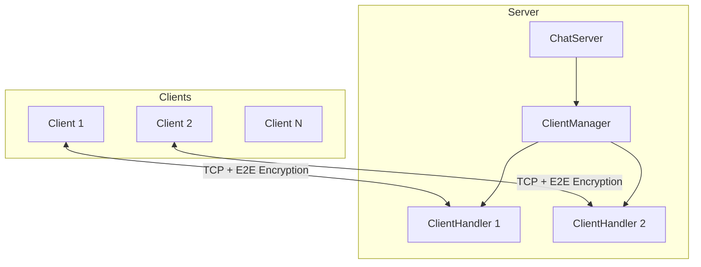
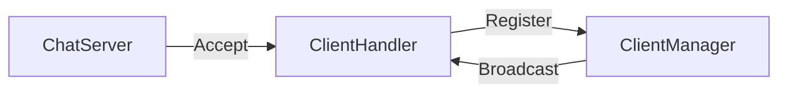
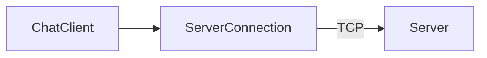
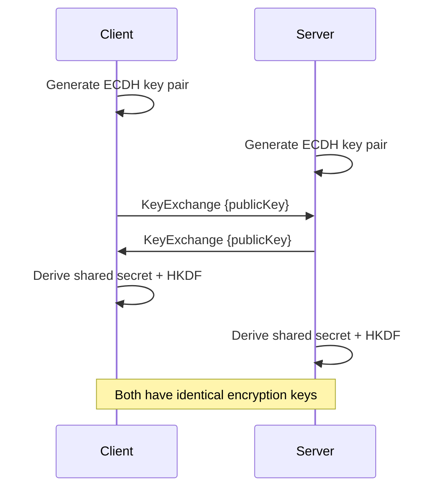
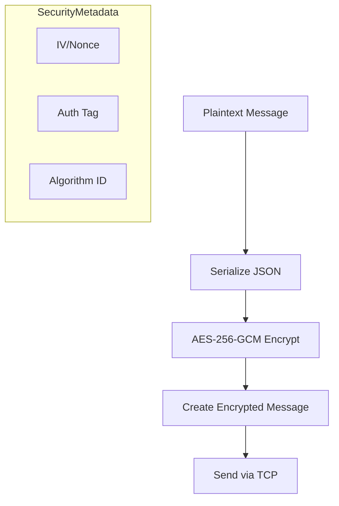
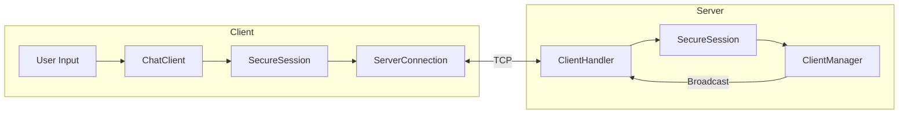

# SecureChat-System Architecture Overview

## System Architecture



---

## Project Structure

```
SecureChat-System/
├── src/
│   ├── SecureChat.Core/          # Shared library
│   │   ├── Models/               # Message, User, MessageType
│   │   ├── Security/
│   │   │   ├── Interfaces/       # IKeyExchange, ISymmetricEncryption, IMessageSigner
│   │   │   ├── Implementations/  # ECDH, AES-GCM, HMAC, HKDF, SecureSession
│   │   │   └── Stubs/            # Placeholder implementations
│   │   ├── Networking/           # Message serialization
│   │   └── Utilities/            # Logging, SecureRandom
│   │
│   ├── SecureChat.Server/        # TCP chat server
│   │   ├── ChatServer.cs         # Accepts connections
│   │   ├── ClientHandler.cs      # Per-client handling
│   │   └── ClientManager.cs      # Client registry
│   │
│   └── SecureChat.Client/        # TCP chat client
│       ├── ChatClient.cs         # High-level operations
│       └── ServerConnection.cs   # TCP management
│
└── tests/SecureChat.Tests/       # Unit tests
```

---

## Component Overview

### SecureChat.Core

The shared library containing all common code:

| Component | Purpose |
|-----------|---------|
| **Models** | `Message`, `User`, `MessageType`, `SecurityMetadata` |
| **Security/Interfaces** | Contracts for crypto operations |
| **Security/Implementations** | Production crypto implementations |
| **Networking** | JSON message serialization |
| **Utilities** | Logging and secure random |

### SecureChat.Server

TCP server accepting multiple client connections:



### SecureChat.Client

TCP client connecting to the server:



---

## Cryptographic Architecture

### Security Stack

```
┌─────────────────────────────────────────┐
│            SecureSession                │  ← Orchestration
├─────────────────────────────────────────┤
│  ECDH P-256  │  AES-256-GCM  │ HMAC-256 │  ← Algorithms
├─────────────────────────────────────────┤
│           HKDF Key Derivation           │  ← Key Management
├─────────────────────────────────────────┤
│      .NET Cryptography Primitives       │  ← Foundation
└─────────────────────────────────────────┘
```

### Key Exchange Flow



### Message Encryption



---

## Wire Protocol

### Message Framing

```
┌──────────────────┬─────────────────────────────────────┐
│ 4 bytes (Int32)  │         N bytes (UTF-8 JSON)        │
│  Message Length  │           Message Payload           │
│  (Big-Endian)    │                                     │
└──────────────────┴─────────────────────────────────────┘
```

### Message Types

| Type | Value | Purpose |
|------|-------|---------|
| Text | 0 | Regular chat message |
| Join | 1 | User joining |
| Leave | 2 | User leaving |
| KeyExchange | 3 | Public key exchange |
| Encrypted | 4 | Encrypted payload |
| Error | 5 | Error notification |
| System | 6 | Server announcements |

---

## Security Measures

| Layer | Protection |
|-------|------------|
| **Transport** | Length-prefixed framing (injection prevention) |
| **Key Exchange** | ECDH P-256 with key validation |
| **Encryption** | AES-256-GCM (AEAD - confidentiality + integrity) |
| **Key Derivation** | HKDF-SHA256 with domain separation |
| **Memory** | Secure zeroing of key material |

---

## Data Flow



---

## Dependencies

- **.NET 8.0+** - Runtime
- **System.Security.Cryptography** - Crypto primitives
- **System.Text.Json** - Message serialization
- **xUnit** - Testing framework
