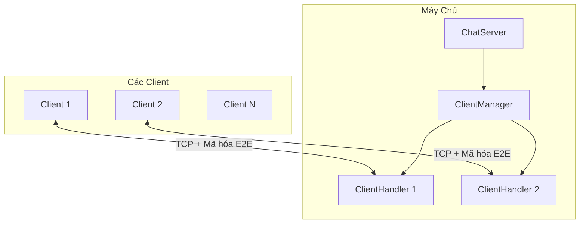
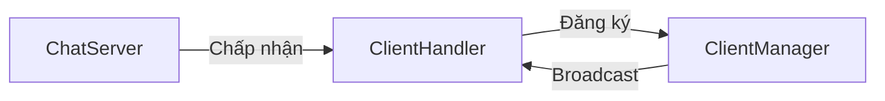
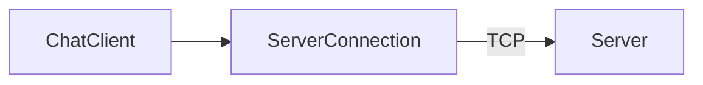
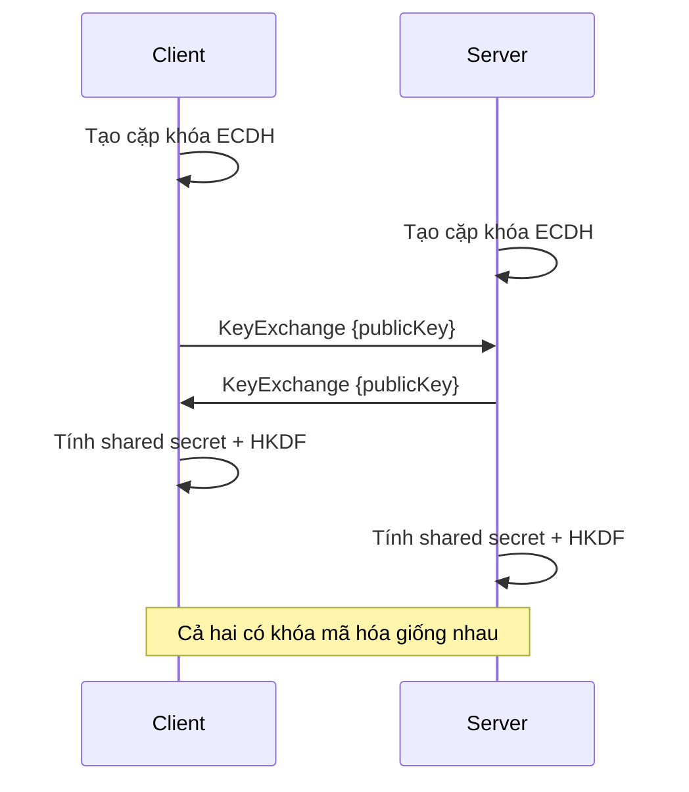
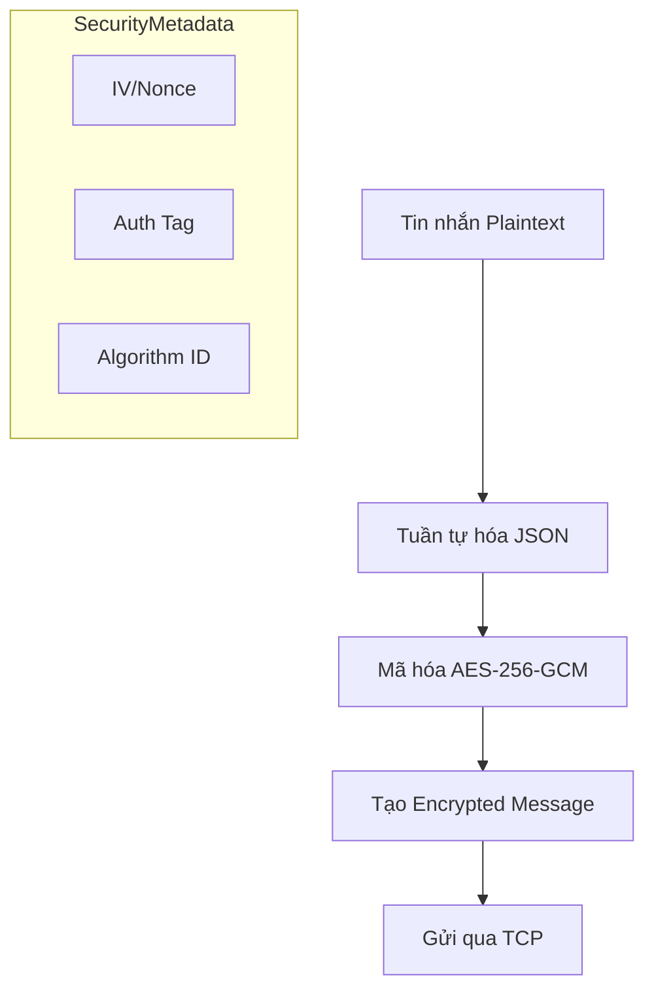
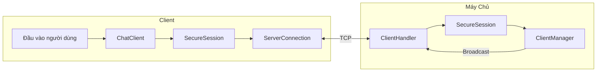

# Tổng Quan Kiến Trúc SecureChat-System

## Kiến Trúc Hệ Thống



---

## Cấu Trúc Dự Án

```
SecureChat-System/
├── src/
│   ├── SecureChat.Core/          # Thư viện dùng chung
│   │   ├── Models/               # Message, User, MessageType
│   │   ├── Security/
│   │   │   ├── Interfaces/       # IKeyExchange, ISymmetricEncryption, IMessageSigner
│   │   │   ├── Implementations/  # ECDH, AES-GCM, HMAC, HKDF, SecureSession
│   │   │   └── Stubs/            # Các triển khai tạm thời
│   │   ├── Networking/           # Tuần tự hóa tin nhắn
│   │   └── Utilities/            # Logging, SecureRandom
│   │
│   ├── SecureChat.Server/        # Máy chủ TCP chat
│   │   ├── ChatServer.cs         # Chấp nhận kết nối
│   │   ├── ClientHandler.cs      # Xử lý từng client
│   │   └── ClientManager.cs      # Quản lý danh sách client
│   │
│   └── SecureChat.Client/        # Client TCP chat
│       ├── ChatClient.cs         # Các thao tác cấp cao
│       └── ServerConnection.cs   # Quản lý kết nối TCP
│
└── tests/SecureChat.Tests/       # Unit tests
```

---

## Tổng Quan Các Thành Phần

### SecureChat.Core

Thư viện dùng chung chứa tất cả mã nguồn chung:

| Thành Phần | Mục Đích |
|------------|----------|
| **Models** | `Message`, `User`, `MessageType`, `SecurityMetadata` |
| **Security/Interfaces** | Các hợp đồng cho thao tác mã hóa |
| **Security/Implementations** | Triển khai mã hóa production |
| **Networking** | Tuần tự hóa tin nhắn JSON |
| **Utilities** | Logging và sinh số ngẫu nhiên an toàn |

### SecureChat.Server

Máy chủ TCP chấp nhận nhiều kết nối client:



### SecureChat.Client

Client TCP kết nối đến máy chủ:



---

## Kiến Trúc Mật Mã

### Stack Bảo Mật

```
┌─────────────────────────────────────────┐
│            SecureSession                │  ← Điều phối
├─────────────────────────────────────────┤
│  ECDH P-256  │  AES-256-GCM  │ HMAC-256 │  ← Thuật toán
├─────────────────────────────────────────┤
│           HKDF Key Derivation           │  ← Quản lý khóa
├─────────────────────────────────────────┤
│      .NET Cryptography Primitives       │  ← Nền tảng
└─────────────────────────────────────────┘
```

### Quy Trình Trao Đổi Khóa



### Mã Hóa Tin Nhắn



---

## Giao Thức Truyền Tải

### Định Dạng Tin Nhắn

```
┌──────────────────┬─────────────────────────────────────┐
│ 4 bytes (Int32)  │         N bytes (UTF-8 JSON)        │
│  Độ dài tin nhắn │           Nội dung tin nhắn         │
│  (Big-Endian)    │                                     │
└──────────────────┴─────────────────────────────────────┘
```

### Các Loại Tin Nhắn

| Loại | Giá Trị | Mục Đích |
|------|---------|----------|
| Text | 0 | Tin nhắn chat thông thường |
| Join | 1 | Người dùng tham gia |
| Leave | 2 | Người dùng rời đi |
| KeyExchange | 3 | Trao đổi khóa công khai |
| Encrypted | 4 | Nội dung đã mã hóa |
| Error | 5 | Thông báo lỗi |
| System | 6 | Thông báo từ máy chủ |

---

## Các Biện Pháp Bảo Mật

| Tầng | Bảo Vệ |
|------|--------|
| **Truyền tải** | Định dạng có độ dài (ngăn chặn injection) |
| **Trao đổi khóa** | ECDH P-256 với xác thực khóa |
| **Mã hóa** | AES-256-GCM (AEAD - bảo mật + toàn vẹn) |
| **Dẫn xuất khóa** | HKDF-SHA256 với phân tách miền |
| **Bộ nhớ** | Xóa an toàn dữ liệu khóa |

---

## Luồng Dữ Liệu



---

## Các Phụ Thuộc

- **.NET 8.0+** - Runtime
- **System.Security.Cryptography** - Các nguyên thủy mã hóa
- **System.Text.Json** - Tuần tự hóa tin nhắn
- **xUnit** - Framework kiểm thử
