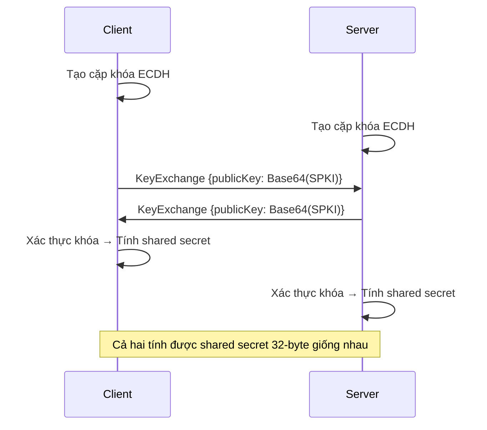

# Đặc Tả Mật Mã SecureChat

**Phiên bản**: 1.0  
**Trạng thái**: Đã triển khai  
**Issue**: #12 - Lựa chọn thuật toán mật mã

---

## Tổng Quan

SecureChat triển khai stack mật mã hiện đại sử dụng các thuật toán được NIST phê duyệt và các thực tiễn tốt nhất trong ngành. Tài liệu này chính thức hóa các lựa chọn thuật toán, kích thước khóa và lý do bảo mật.

```
┌─────────────────────────────────────────────────────────────┐
│                      SecureSession                          │  ← Điều phối
├─────────────────────────────────────────────────────────────┤
│   ECDH P-256   │   AES-256-GCM   │   HMAC-SHA256           │  ← Thuật toán
├─────────────────────────────────────────────────────────────┤
│                 HKDF-SHA256 Key Derivation                  │  ← Quản lý khóa
├─────────────────────────────────────────────────────────────┤
│               .NET Cryptography Primitives                  │  ← Nền tảng
└─────────────────────────────────────────────────────────────┘
```

---

## Tóm Tắt Thuật Toán

| Chức năng | Thuật toán | Kích thước khóa | Tiêu chuẩn |
|-----------|------------|-----------------|------------|
| **Trao đổi khóa** | ECDH P-256 | Đường cong 256-bit | NIST FIPS 186-4 |
| **Mã hóa** | AES-256-GCM | 256-bit | NIST SP 800-38D |
| **Xác thực tin nhắn** | HMAC-SHA256 | 256-bit | RFC 2104 / FIPS 198-1 |
| **Dẫn xuất khóa** | HKDF-SHA256 | Đầu ra 256-bit | RFC 5869 |

> [!NOTE]
> Tất cả các triển khai sử dụng thư viện `System.Security.Cryptography` của .NET, cung cấp các thao tác được tăng tốc phần cứng và thời gian hằng số.

---

## Trao Đổi Khóa: ECDH P-256

### Đặc Tả

| Tham số | Giá trị | Lý do |
|---------|---------|-------|
| **Thuật toán** | ECDH (Elliptic Curve Diffie-Hellman) | Forward secrecy, khóa nhỏ hơn RSA |
| **Đường cong** | NIST P-256 (secp256r1) | Hỗ trợ phần cứng rộng, tiêu chuẩn NIST |
| **Kích thước khóa** | 256-bit | Tương đương ~3072-bit RSA |
| **Định dạng xuất** | SPKI (Subject Public Key Info) | Khả năng tương tác, bao gồm tham số đường cong |
| **Mức bảo mật** | 128-bit | Được NIST phê duyệt đến 2030+ |

### Thiết Kế Bảo Mật



### Xác Thực Khóa

Trước khi tính shared secret, khóa công khai PHẢI được xác thực:

1. **Xác thực định dạng**: Khóa giải mã được dưới dạng Base64 hợp lệ
2. **Phân tích SPKI**: Khóa nhập thành công dưới dạng khóa công khai ECDH
3. **Xác minh đường cong**: Khóa nằm trên đường cong NIST P-256 (OID: 1.2.840.10045.3.1.7)
4. **Kiểm tra độ dài**: Tất cả các byte được sử dụng (không có dữ liệu thừa)

> [!CAUTION]
> **Tấn công Invalid Point**: Chấp nhận khóa công khai không nằm trên đường cong có thể dẫn đến việc khôi phục shared secret. Luôn xác thực!

### Tham Chiếu Triển Khai

| File | Mục đích |
|------|----------|
| [IKeyExchange.cs](file:///Users/quocvinhtrinhlam/Desktop/SecureChat-System/src/SecureChat.Core/Security/Interfaces/IKeyExchange.cs) | Interface trao đổi khóa |
| [EcdhKeyExchange.cs](file:///Users/quocvinhtrinhlam/Desktop/SecureChat-System/src/SecureChat.Core/Security/Implementations/EcdhKeyExchange.cs) | Triển khai ECDH P-256 |

---

## Dẫn Xuất Khóa: HKDF-SHA256

### Đặc Tả

| Tham số | Giá trị | Lý do |
|---------|---------|-------|
| **Thuật toán** | HKDF (HMAC-based KDF) | RFC 5869, bảo mật đã được chứng minh |
| **Hàm băm** | SHA-256 | Bảo mật 256-bit, được hỗ trợ rộng rãi |
| **Độ dài khóa đầu ra** | 256-bit (32 bytes) | Phù hợp với yêu cầu AES-256 và HMAC-SHA256 |
| **Salt** | 32 bytes (tùy chọn) | Thêm entropy, phân tách phiên |
| **Info** | Chuỗi ngữ cảnh | Phân tách miền giữa các khóa |

### Chiến Lược Phân Tách Khóa

Cùng một shared secret dẫn xuất **các khóa khác nhau** cho các mục đích khác nhau sử dụng tham số `info` duy nhất:

```
Shared Secret (từ ECDH)
         │
         ▼
    ┌─────────┐
    │  HKDF   │
    └────┬────┘
         │
    ┌────┴────┐
    ▼         ▼
┌───────────────────────┐   ┌───────────────────────┐
│ info="SecureChat-v1-  │   │ info="SecureChat-v1-  │
│       encryption-key" │   │       mac-key"        │
│                       │   │                       │
│   Khóa Mã hóa         │   │      Khóa MAC         │
│     (256-bit)         │   │     (256-bit)         │
└───────────────────────┘   └───────────────────────┘
```

### Phiên Bản Giao Thức

Các khóa bao gồm định danh phiên bản `SecureChat-v1` trong tham số info:
- Cho phép xoay khóa sạch sẽ khi giao thức thay đổi
- Ngăn chặn tái sử dụng khóa giữa các phiên bản

### Tham Chiếu Triển Khai

| File | Mục đích |
|------|----------|
| [HkdfKeyDerivation.cs](file:///Users/quocvinhtrinhlam/Desktop/SecureChat-System/src/SecureChat.Core/Security/Implementations/HkdfKeyDerivation.cs) | Tiện ích HKDF cho khóa phiên |

---

## Mã Hóa Đối Xứng: AES-256-GCM

### Đặc Tả

| Tham số | Giá trị | Lý do |
|---------|---------|-------|
| **Thuật toán** | AES-GCM (Galois/Counter Mode) | AEAD - mã hóa + xác thực |
| **Kích thước khóa** | 256-bit | Bảo mật AES tối đa |
| **Kích thước Nonce** | 96-bit (12 bytes) | Khuyến nghị NIST SP 800-38D |
| **Kích thước Tag** | 128-bit (16 bytes) | Độ mạnh xác thực tối đa |

### Tại Sao AES-GCM?

AES-GCM là một lược đồ **Mã hóa Xác thực với Dữ liệu Liên quan (AEAD)**:

| Thuộc tính | Lợi ích |
|------------|---------|
| **Bảo mật** | Ciphertext không tiết lộ gì về plaintext |
| **Toàn vẹn** | Phát hiện mọi sự giả mạo |
| **Xác thực** | Xác minh nguồn gốc tin nhắn |
| **Nguyên tử** | Giải mã thất bại hoàn toàn nếu tag không khớp |

### Yêu Cầu Nonce

> [!CAUTION]
> **Quan trọng**: Không bao giờ tái sử dụng nonce với cùng một khóa. Tái sử dụng nonce **phá vỡ hoàn toàn** bảo mật AES-GCM!

| Yêu cầu | Triển khai SecureChat |
|---------|----------------------|
| **Tính duy nhất** | `RandomNumberGenerator.Fill()` tạo nonce ngẫu nhiên mật mã |
| **Kích thước** | Cố định 96-bit theo khuyến nghị NIST |
| **Truyền tải** | Gửi kèm mỗi tin nhắn (không bí mật) |

### Định Dạng Truyền Tải

```
┌──────────────────┬──────────────────────────┬──────────────┐
│   IV (12 bytes)  │   Ciphertext (N bytes)   │ Tag (16 B)   │
│   Base64 trong   │   Base64 trong           │ Base64 trong │
│   metadata.iv    │   content                │ metadata.sig │
└──────────────────┴──────────────────────────┴──────────────┘
```

### Tham Chiếu Triển Khai

| File | Mục đích |
|------|----------|
| [ISymmetricEncryption.cs](file:///Users/quocvinhtrinhlam/Desktop/SecureChat-System/src/SecureChat.Core/Security/Interfaces/ISymmetricEncryption.cs) | Interface mã hóa |
| [AesGcmEncryption.cs](file:///Users/quocvinhtrinhlam/Desktop/SecureChat-System/src/SecureChat.Core/Security/Implementations/AesGcmEncryption.cs) | Triển khai AES-256-GCM |

---

## Xác Thực Tin Nhắn: HMAC-SHA256

### Đặc Tả

| Tham số | Giá trị | Lý do |
|---------|---------|-------|
| **Thuật toán** | HMAC-SHA256 | RFC 2104, FIPS 198-1 |
| **Kích thước khóa** | 256-bit | Phù hợp với kích thước block SHA-256 |
| **Kích thước Tag** | 256-bit (32 bytes) | Đầu ra hash đầy đủ |

### Ngữ Cảnh Sử Dụng

Mặc dù AES-GCM cung cấp xác thực tích hợp, HMAC-SHA256 có sẵn cho:

1. **Lớp MAC bổ sung** nếu sử dụng mẫu encrypt-then-MAC
2. **Xác nhận khóa** trong quá trình handshake
3. **Toàn vẹn tin nhắn không mã hóa** (vd: tin nhắn giao thức)

### Kháng Tấn Công Timing

```csharp
// SAI - dễ bị tấn công timing
if (computedSignature == expectedSignature)

// ĐÚNG - so sánh thời gian hằng số
CryptographicOperations.FixedTimeEquals(computed, expected);
```

> [!IMPORTANT]
> Tất cả các xác minh chữ ký sử dụng `CryptographicOperations.FixedTimeEquals()` để ngăn chặn tấn công kênh phụ timing.

### Tham Chiếu Triển Khai

| File | Mục đích |
|------|----------|
| [IMessageSigner.cs](file:///Users/quocvinhtrinhlam/Desktop/SecureChat-System/src/SecureChat.Core/Security/Interfaces/IMessageSigner.cs) | Interface ký tin nhắn |
| [HmacSha256Signer.cs](file:///Users/quocvinhtrinhlam/Desktop/SecureChat-System/src/SecureChat.Core/Security/Implementations/HmacSha256Signer.cs) | Triển khai HMAC-SHA256 |

---

## Thuộc Tính Bảo Mật

### Các Mục Tiêu Bảo Mật Đạt Được

| Mục tiêu | Thuật toán | Trạng thái |
|----------|------------|------------|
| **Bảo mật** | AES-256-GCM | Đã triển khai |
| **Toàn vẹn** | AES-GCM Tag / HMAC | Đã triển khai |
| **Xác thực** | Trao đổi khóa ECDH | Đã triển khai |
| **Forward Secrecy** | ECDH tạm thời | Mỗi phiên tạo khóa mới |
| **Phân tách khóa** | HKDF với tag miền | Khóa mã hóa và MAC được dẫn xuất riêng |

### Độ Mạnh Mật Mã

Tất cả các thuật toán cung cấp **mức bảo mật 128-bit**:

| Thuật toán | Mức bảo mật | Ghi chú |
|------------|-------------|---------|
| ECDH P-256 | 128-bit | Tương đương 3072-bit RSA |
| AES-256 | 256-bit | Vượt yêu cầu |
| SHA-256 | Kháng va chạm 128-bit | Kháng preimage 256-bit |
| HMAC-SHA256 | 256-bit | Bảo mật hash đầy đủ |

### An Toàn Bộ Nhớ

Dữ liệu nhạy cảm được xóa khỏi bộ nhớ sau khi sử dụng:

```csharp
// Xóa shared secret, plaintext và các khóa
CryptographicOperations.ZeroMemory(sensitiveData);
```

| Loại dữ liệu | Chiến lược xóa |
|--------------|----------------|
| Shared secrets | Xóa ngay sau khi dẫn xuất khóa |
| Plaintext bytes | Xóa sau khi mã hóa |
| Khóa riêng | Xóa khi Dispose() |

---

## Lý Do Lựa Chọn Thuật Toán

### Tại Sao P-256 Thay Vì X25519?

| Yếu tố | P-256 | X25519 |
|--------|-------|--------|
| **Tiêu chuẩn** | NIST FIPS 186-4 | RFC 7748 |
| **Hỗ trợ phần cứng** | Xuất sắc (.NET native) | Hạn chế |
| **Tuân thủ** | Chính phủ/Doanh nghiệp | Giao thức hiện đại |
| **Khả năng tương tác** | Rộng | Đang phát triển |

**Quyết định**: P-256 được chọn vì khả năng tương thích rộng và hỗ trợ native của .NET.

### Tại Sao AES-GCM Thay Vì ChaCha20-Poly1305?

| Yếu tố | AES-GCM | ChaCha20-Poly1305 |
|--------|---------|-------------------|
| **Tăng tốc phần cứng** | AES-NI trên hầu hết CPU | Chỉ phần mềm trên .NET |
| **Tiêu chuẩn** | NIST | IETF RFC 7539 |
| **Hiệu suất** | Nhanh hơn với AES-NI | Nhanh hơn khi không có |

**Quyết định**: AES-GCM được chọn vì tăng tốc phần cứng và tuân thủ NIST.

### Tại Sao Tách Riêng Khóa MAC?

Mặc dù AES-GCM cung cấp xác thực:
- **Phòng thủ theo chiều sâu**: Lớp xác minh bổ sung
- **Linh hoạt giao thức**: Có thể xác thực dữ liệu không mã hóa
- **Cách ly khi khóa bị xâm phạm**: Các khóa riêng hạn chế thiệt hại

---

## Ghi Chú Tuân Thủ

### Tuân Thủ Tiêu Chuẩn

| Tiêu chuẩn | Trạng thái |
|------------|------------|
| **NIST SP 800-38D** (AES-GCM) | Tuân thủ |
| **NIST SP 800-56A** (Thỏa thuận khóa) | Tuân thủ |
| **NIST SP 800-56C** (Dẫn xuất khóa) | Tuân thủ |
| **RFC 5869** (HKDF) | Tuân thủ |
| **RFC 2104** (HMAC) | Tuân thủ |

### Khuyến Nghị Bảo Mật

> [!WARNING]
> Các thuật toán này được NIST phê duyệt đến 2030+. Hãy lên kế hoạch cho việc chuyển đổi hậu lượng tử khi các tiêu chuẩn xuất hiện.

---

## Thẻ Tham Khảo Nhanh

```
┌─────────────────────────────────────────────────────────────┐
│             THAM KHẢO NHANH CRYPTO SECURECHAT               │
├─────────────────────────────────────────────────────────────┤
│                                                             │
│  TRAO ĐỔI KHÓA                                              │
│  ├── Thuật toán:   ECDH                                     │
│  ├── Đường cong:   P-256 (secp256r1)                        │
│  ├── Kích thước:   256-bit                                  │
│  └── Định dạng:    SPKI (Base64)                            │
│                                                             │
│  DẪN XUẤT KHÓA                                              │
│  ├── Thuật toán:   HKDF                                     │
│  ├── Hash:         SHA-256                                  │
│  ├── Salt:         32 bytes (tùy chọn)                      │
│  └── Info:         "SecureChat-v1-{purpose}"                │
│                                                             │
│  MÃ HÓA                                                     │
│  ├── Thuật toán:   AES-GCM                                  │
│  ├── Kích thước:   256-bit                                  │
│  ├── Nonce:        96-bit (ngẫu nhiên mỗi tin)              │
│  └── Tag:          128-bit                                  │
│                                                             │
│  XÁC THỰC TIN NHẮN                                          │
│  ├── Thuật toán:   HMAC-SHA256                              │
│  ├── Kích thước:   256-bit                                  │
│  └── Tag:          256-bit                                  │
│                                                             │
└─────────────────────────────────────────────────────────────┘
```

---

## Xem Thêm

- [ARCHITECTURE.md](file:///Users/quocvinhtrinhlam/Desktop/SecureChat-System/docs/ARCHITECTURE.md) - Tổng quan kiến trúc hệ thống
- [MESSAGE_PROTOCOL.md](file:///Users/quocvinhtrinhlam/Desktop/SecureChat-System/docs/MESSAGE_PROTOCOL.md) - Đặc tả giao thức truyền tải
- [SecureSession.cs](file:///Users/quocvinhtrinhlam/Desktop/SecureChat-System/src/SecureChat.Core/Security/Implementations/SecureSession.cs) - Điều phối phiên
