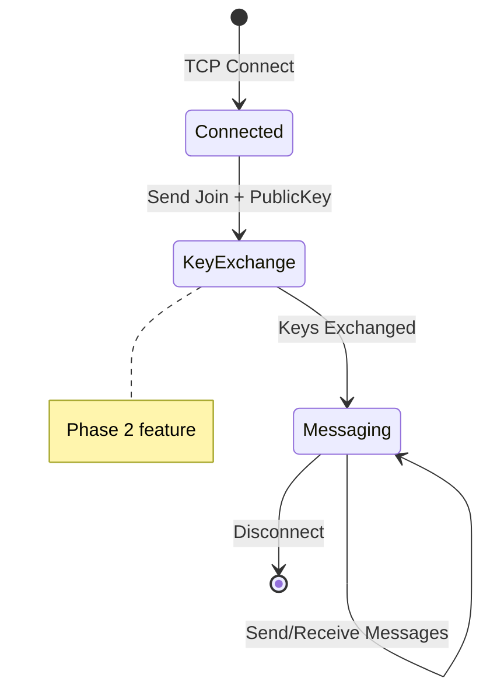

# SecureChat Message Protocol Specification

**Version**: 1.0  
**Status**: Foundation Phase (Encryption Planned)

---

## Protocol Overview

SecureChat uses a JSON-based message protocol over TCP with length-prefixed framing. This document defines the wire format, message structure, types, and validation rules.

### Transport

| Property        | Value           |
|-----------------|-----------------|
| Transport       | TCP             |
| Encoding        | UTF-8           |
| Serialization   | JSON            |
| Max Message Size| 64 KB (65,536 bytes) |

---

## Wire Format

All messages use **length-prefixed framing** to prevent injection attacks and enable proper message boundary detection.

```
┌──────────────────┬─────────────────────────────────────┐
│ 4 bytes (Int32)  │         N bytes (UTF-8 JSON)        │
│  Message Length  │           Message Payload           │
│  (Big-Endian)    │                                     │
└──────────────────┴─────────────────────────────────────┘
```

### Framing Details

| Field          | Size    | Description                              |
|----------------|---------|------------------------------------------|
| Length Prefix  | 4 bytes | Big-endian Int32, payload size in bytes  |
| Payload        | N bytes | UTF-8 encoded JSON message               |

> [!IMPORTANT]
> The length prefix specifies **only the payload size**, not including itself.

---

## Message Structure

### Base Message Schema

```json
{
  "id": "uuid-v4-string",
  "type": "Text | Join | Leave | KeyExchange | Encrypted | Error | System",
  "senderId": "user-uuid-string",
  "senderName": "Display Name",
  "content": "Message content or encrypted payload",
  "timestamp": "2026-01-19T12:30:00Z",
  "securityMetadata": { ... } // Optional, for encrypted messages
}
```

### Field Definitions

| Field            | Type     | Required | Description                                    |
|------------------|----------|----------|------------------------------------------------|
| `id`             | string   | ✓        | UUID v4 for deduplication and replay prevention|
| `type`           | enum     | ✓        | Message type (see Message Types)               |
| `senderId`       | string   | ✓        | Sender's unique identifier                     |
| `senderName`     | string   | ✓        | Display name (sanitize before display)         |
| `content`        | string   | ✓        | Message content (max 10,000 chars)             |
| `timestamp`      | ISO 8601 | ✓        | UTC creation time                              |
| `securityMetadata`| object  |          | Cryptographic data for encrypted messages      |

---

## Message Types

| Type          | Value | Description                              |
|---------------|-------|------------------------------------------|
| `Text`        | 0     | Regular chat message                     |
| `Join`        | 1     | User joining notification                |
| `Leave`       | 2     | User leaving notification                |
| `KeyExchange` | 3     | Public key exchange                      |
| `Encrypted`   | 4     | Encrypted payload (requires metadata)    |
| `Error`       | 5     | Error notification                       |
| `System`      | 6     | Server announcements                     |

### Type-Specific Content

#### Text Message
```json
{
  "type": "Text",
  "content": "Hello, everyone!"
}
```

#### Join Message
```json
{
  "type": "Join",
  "content": "Alice has joined the chat"
}
```

#### KeyExchange Message
```json
{
  "type": "KeyExchange",
  "content": "Base64-encoded-public-key"
}
```

#### Encrypted Message
```json
{
  "type": "Encrypted",
  "content": "Base64-encoded-ciphertext",
  "securityMetadata": {
    "algorithm": "AES-256-GCM",
    "iv": "Base64-encoded-iv",
    "signature": "Base64-encoded-auth-tag",
    "keyId": "optional-key-identifier"
  }
}
```

---

## Security Metadata

Required for `Encrypted` type messages:

```json
{
  "algorithm": "AES-256-GCM",
  "iv": "Base64-encoded-initialization-vector",
  "signature": "Base64-encoded-authentication-tag-or-hmac",
  "keyId": "optional-key-rotation-identifier"
}
```

| Field       | Type   | Description                                     |
|-------------|--------|-------------------------------------------------|
| `algorithm` | string | Encryption algorithm (e.g., `AES-256-GCM`)      |
| `iv`        | string | Base64-encoded IV/nonce (must be unique per message) |
| `signature` | string | Base64-encoded authentication tag or HMAC       |
| `keyId`     | string | Optional key identifier for key rotation        |

> [!CAUTION]
> **Never reuse IVs!** Each message MUST have a unique initialization vector.

---

## Validation Rules

### Required Field Validation
- `id` - Non-empty string (UUID format)
- `senderId` - Non-empty string
- `senderName` - Non-empty string (max 32 characters)
- `content` - Max 10,000 characters

### Timestamp Validation
- Must be within ±5 minutes of server time
- Prevents replay attacks with stale messages

### Size Limits
| Constraint       | Limit                    |
|------------------|--------------------------|
| Total message    | 64 KB (65,536 bytes)     |
| Content length   | 10,000 characters        |
| Username length  | 32 characters            |

---

## Protocol State Machine



### Connection Lifecycle

1. **Connect**: Client establishes TCP connection
2. **Join**: Client sends `Join` message with username
3. **Key Exchange** (Phase 2): Exchange public keys via `KeyExchange` messages
4. **Messaging**: Exchange `Text` or `Encrypted` messages
5. **Leave**: Client sends `Leave` message on disconnect

---

## Example Messages

### Text Message (Plaintext Phase)
```json
{
  "id": "550e8400-e29b-41d4-a716-446655440000",
  "type": "Text",
  "senderId": "user-123",
  "senderName": "Alice",
  "content": "Hello, Bob!",
  "timestamp": "2026-01-19T05:30:00Z",
  "securityMetadata": null
}
```

### Encrypted Message (Phase 2)
```json
{
  "id": "6ba7b810-9dad-11d1-80b4-00c04fd430c8",
  "type": "Encrypted",
  "senderId": "user-123",
  "senderName": "Alice",
  "content": "aGVsbG8gd29ybGQ=",
  "timestamp": "2026-01-19T05:30:00Z",
  "securityMetadata": {
    "algorithm": "AES-256-GCM",
    "iv": "dGhpcyBpcyBhIHRlc3Q=",
    "signature": "c2lnbmF0dXJl",
    "keyId": null
  }
}
```

---

## Implementation Reference

| File | Purpose |
|------|---------|
| [Message.cs](file:///Users/quocvinhtrinhlam/Desktop/SecureChat-System/src/SecureChat.Core/Models/Message.cs) | Core message model |
| [MessageType.cs](file:///Users/quocvinhtrinhlam/Desktop/SecureChat-System/src/SecureChat.Core/Models/MessageType.cs) | Message type enumeration |
| [JsonMessageSerializer.cs](file:///Users/quocvinhtrinhlam/Desktop/SecureChat-System/src/SecureChat.Core/Networking/JsonMessageSerializer.cs) | Serialization implementation |
