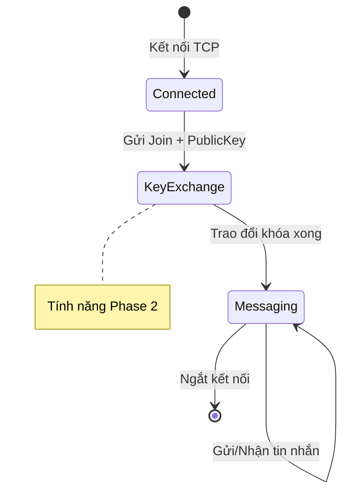

# Đặc Tả Giao Thức Tin Nhắn SecureChat

**Phiên bản**: 1.0  
**Trạng thái**: Giai đoạn Nền tảng (Đang lên kế hoạch Mã hóa)

---

## Tổng Quan Giao Thức

SecureChat sử dụng giao thức tin nhắn dựa trên JSON qua TCP với định dạng có tiền tố độ dài. Tài liệu này định nghĩa định dạng truyền tải, cấu trúc tin nhắn, các loại và quy tắc xác thực.

### Truyền Tải

| Thuộc tính         | Giá trị          |
|--------------------|------------------|
| Giao thức          | TCP              |
| Mã hóa ký tự       | UTF-8            |
| Tuần tự hóa        | JSON             |
| Kích thước tối đa  | 64 KB (65,536 bytes) |

---

## Định Dạng Truyền Tải

Tất cả tin nhắn sử dụng **định dạng có tiền tố độ dài** để ngăn chặn tấn công injection và cho phép phát hiện ranh giới tin nhắn chính xác.

```
┌──────────────────┬─────────────────────────────────────┐
│ 4 bytes (Int32)  │         N bytes (UTF-8 JSON)        │
│  Độ dài tin nhắn │         Nội dung tin nhắn           │
│  (Big-Endian)    │                                     │
└──────────────────┴─────────────────────────────────────┘
```

### Chi Tiết Định Dạng

| Trường          | Kích thước | Mô tả                                    |
|-----------------|------------|------------------------------------------|
| Tiền tố độ dài  | 4 bytes    | Int32 Big-endian, kích thước payload     |
| Payload         | N bytes    | Tin nhắn JSON mã hóa UTF-8               |

> [!IMPORTANT]
> Tiền tố độ dài chỉ định **chỉ kích thước payload**, không bao gồm chính nó.

---

## Cấu Trúc Tin Nhắn

### Schema Tin Nhắn Cơ Bản

```json
{
  "id": "uuid-v4-string",
  "type": "Text | Join | Leave | KeyExchange | Encrypted | Error | System",
  "senderId": "user-uuid-string",
  "senderName": "Tên Hiển Thị",
  "content": "Nội dung tin nhắn hoặc payload đã mã hóa",
  "timestamp": "2026-01-19T12:30:00Z",
  "securityMetadata": { ... } // Tùy chọn, cho tin nhắn đã mã hóa
}
```

### Định Nghĩa Các Trường

| Trường            | Kiểu     | Bắt buộc | Mô tả                                          |
|-------------------|----------|----------|------------------------------------------------|
| `id`              | string   | ✓        | UUID v4 để loại bỏ trùng lặp và ngăn replay    |
| `type`            | enum     | ✓        | Loại tin nhắn (xem Các Loại Tin Nhắn)          |
| `senderId`        | string   | ✓        | Định danh duy nhất của người gửi               |
| `senderName`      | string   | ✓        | Tên hiển thị (cần lọc trước khi hiển thị)      |
| `content`         | string   | ✓        | Nội dung tin nhắn (tối đa 10,000 ký tự)        |
| `timestamp`       | ISO 8601 | ✓        | Thời gian tạo UTC                              |
| `securityMetadata`| object   |          | Dữ liệu mã hóa cho tin nhắn đã mã hóa          |

---

## Các Loại Tin Nhắn

| Loại          | Giá trị | Mô tả                                    |
|---------------|---------|------------------------------------------|
| `Text`        | 0       | Tin nhắn chat thông thường               |
| `Join`        | 1       | Thông báo người dùng tham gia            |
| `Leave`       | 2       | Thông báo người dùng rời đi              |
| `KeyExchange` | 3       | Trao đổi khóa công khai                  |
| `Encrypted`   | 4       | Payload đã mã hóa (yêu cầu metadata)     |
| `Error`       | 5       | Thông báo lỗi                            |
| `System`      | 6       | Thông báo từ máy chủ                     |

### Nội Dung Theo Từng Loại

#### Tin Nhắn Text
```json
{
  "type": "Text",
  "content": "Xin chào mọi người!"
}
```

#### Tin Nhắn Join
```json
{
  "type": "Join",
  "content": "Alice đã tham gia chat"
}
```

#### Tin Nhắn KeyExchange
```json
{
  "type": "KeyExchange",
  "content": "Base64-encoded-public-key"
}
```

#### Tin Nhắn Encrypted
```json
{
  "type": "Encrypted",
  "content": "Base64-encoded-ciphertext",
  "securityMetadata": {
    "algorithm": "AES-256-GCM",
    "iv": "Base64-encoded-iv",
    "signature": "Base64-encoded-auth-tag",
    "keyId": "optional-key-identifier"
  }
}
```

---

## Security Metadata

Bắt buộc cho tin nhắn loại `Encrypted`:

```json
{
  "algorithm": "AES-256-GCM",
  "iv": "Base64-encoded-initialization-vector",
  "signature": "Base64-encoded-authentication-tag-or-hmac",
  "keyId": "optional-key-rotation-identifier"
}
```

| Trường      | Kiểu   | Mô tả                                           |
|-------------|--------|-------------------------------------------------|
| `algorithm` | string | Thuật toán mã hóa (vd: `AES-256-GCM`)           |
| `iv`        | string | IV/nonce mã hóa Base64 (phải duy nhất mỗi tin) |
| `signature` | string | Authentication tag hoặc HMAC mã hóa Base64      |
| `keyId`     | string | Định danh khóa tùy chọn cho key rotation        |

> [!CAUTION]
> **Không bao giờ tái sử dụng IV!** Mỗi tin nhắn PHẢI có initialization vector duy nhất.

---

## Quy Tắc Xác Thực

### Xác Thực Trường Bắt Buộc
- `id` - Chuỗi không rỗng (định dạng UUID)
- `senderId` - Chuỗi không rỗng
- `senderName` - Chuỗi không rỗng (tối đa 32 ký tự)
- `content` - Tối đa 10,000 ký tự

### Xác Thực Timestamp
- Phải nằm trong khoảng ±5 phút so với thời gian máy chủ
- Ngăn chặn tấn công replay với tin nhắn cũ

### Giới Hạn Kích Thước
| Ràng buộc         | Giới hạn               |
|-------------------|------------------------|
| Tổng tin nhắn     | 64 KB (65,536 bytes)   |
| Độ dài nội dung   | 10,000 ký tự           |
| Độ dài tên        | 32 ký tự               |

---

## Máy Trạng Thái Giao Thức



### Vòng Đời Kết Nối

1. **Kết nối**: Client thiết lập kết nối TCP
2. **Tham gia**: Client gửi tin nhắn `Join` với tên người dùng
3. **Trao đổi khóa** (Phase 2): Trao đổi khóa công khai qua tin nhắn `KeyExchange`
4. **Nhắn tin**: Trao đổi tin nhắn `Text` hoặc `Encrypted`
5. **Rời đi**: Client gửi tin nhắn `Leave` khi ngắt kết nối

---

## Ví Dụ Tin Nhắn

### Tin Nhắn Text (Giai đoạn Plaintext)
```json
{
  "id": "550e8400-e29b-41d4-a716-446655440000",
  "type": "Text",
  "senderId": "user-123",
  "senderName": "Alice",
  "content": "Xin chào, Bob!",
  "timestamp": "2026-01-19T05:30:00Z",
  "securityMetadata": null
}
```

### Tin Nhắn Encrypted (Phase 2)
```json
{
  "id": "6ba7b810-9dad-11d1-80b4-00c04fd430c8",
  "type": "Encrypted",
  "senderId": "user-123",
  "senderName": "Alice",
  "content": "aGVsbG8gd29ybGQ=",
  "timestamp": "2026-01-19T05:30:00Z",
  "securityMetadata": {
    "algorithm": "AES-256-GCM",
    "iv": "dGhpcyBpcyBhIHRlc3Q=",
    "signature": "c2lnbmF0dXJl",
    "keyId": null
  }
}
```

---

## Tham Chiếu Triển Khai

| File | Mục đích |
|------|----------|
| [Message.cs](file:///Users/quocvinhtrinhlam/Desktop/SecureChat-System/src/SecureChat.Core/Models/Message.cs) | Model tin nhắn cốt lõi |
| [MessageType.cs](file:///Users/quocvinhtrinhlam/Desktop/SecureChat-System/src/SecureChat.Core/Models/MessageType.cs) | Enum loại tin nhắn |
| [JsonMessageSerializer.cs](file:///Users/quocvinhtrinhlam/Desktop/SecureChat-System/src/SecureChat.Core/Networking/JsonMessageSerializer.cs) | Triển khai tuần tự hóa |
