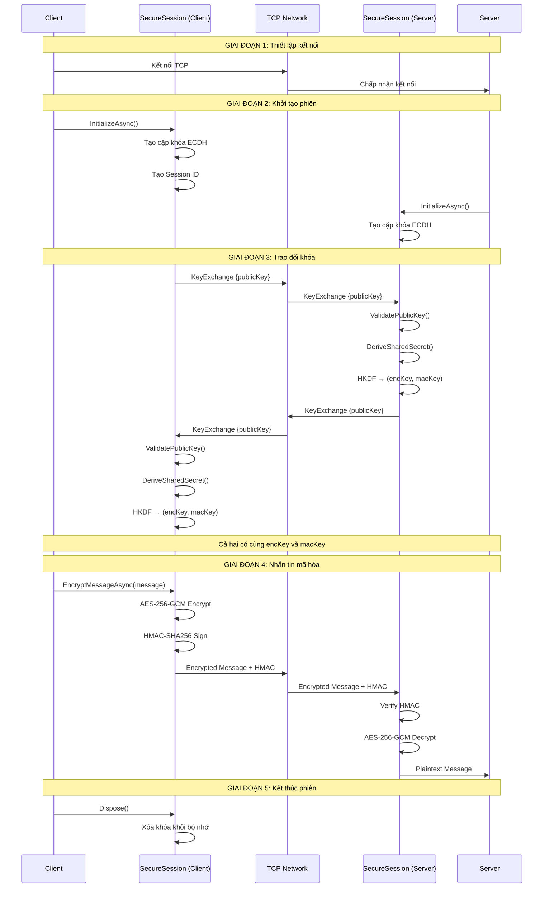
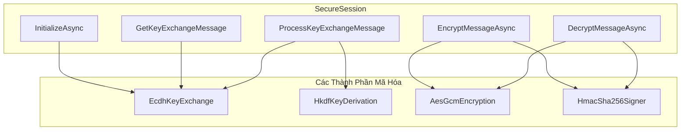
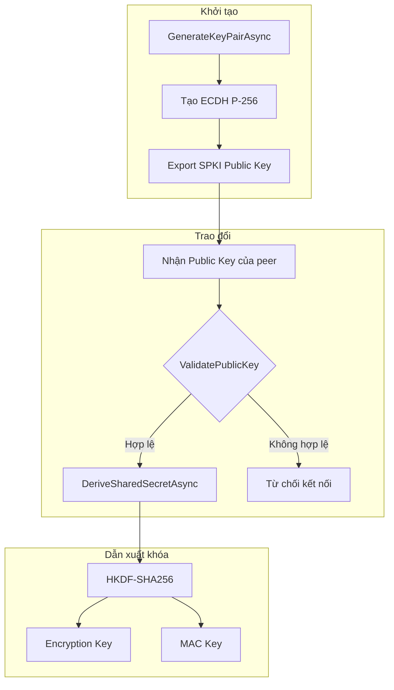
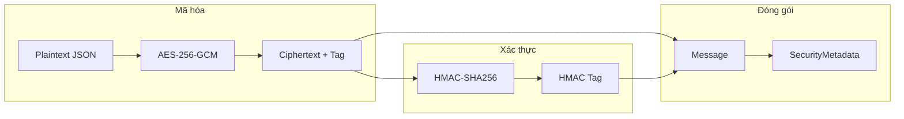
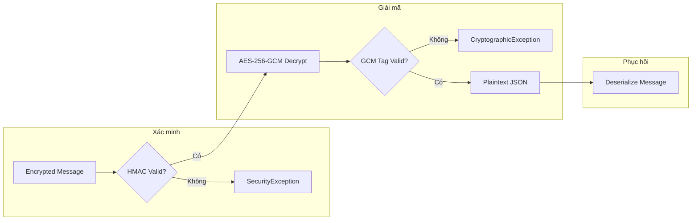

# Luồng Bảo Mật & Hạn Chế SecureChat

**Phiên bản**: 1.0  
**Trạng thái**: Đã triển khai  
**Issue**: #24 - Tài liệu luồng bảo mật & hạn chế

---

## Tổng Quan

Tài liệu này mô tả luồng bảo mật end-to-end của SecureChat-System, cách các thành phần tương tác, và các hạn chế bảo mật đã biết.

```
┌─────────────────────────────────────────────────────────────┐
│                      Luồng Bảo Mật                          │
├─────────────────────────────────────────────────────────────┤
│  1. Kết nối TCP    →  2. Trao đổi khóa  →  3. Nhắn tin      │
│                         ECDH                   Mã hóa       │
├─────────────────────────────────────────────────────────────┤
│  SecureSession điều phối toàn bộ quy trình bảo mật          │
└─────────────────────────────────────────────────────────────┘
```

---

## Luồng Bảo Mật End-to-End

### Sơ Đồ Trình Tự Hoàn Chỉnh



---

## Tương Tác Giữa Các Thành Phần

### Sơ Đồ Thành Phần



### Vai Trò Từng Thành Phần

| Thành Phần | File | Vai Trò |
|------------|------|---------|
| **SecureSession** | [SecureSession.cs](file:///Users/quocvinhtrinhlam/Desktop/SecureChat-System/src/SecureChat.Core/Security/Implementations/SecureSession.cs) | Điều phối toàn bộ quy trình |
| **EcdhKeyExchange** | [EcdhKeyExchange.cs](file:///Users/quocvinhtrinhlam/Desktop/SecureChat-System/src/SecureChat.Core/Security/Implementations/EcdhKeyExchange.cs) | Trao đổi khóa ECDH P-256 |
| **HkdfKeyDerivation** | [HkdfKeyDerivation.cs](file:///Users/quocvinhtrinhlam/Desktop/SecureChat-System/src/SecureChat.Core/Security/Implementations/HkdfKeyDerivation.cs) | Dẫn xuất khóa từ shared secret |
| **AesGcmEncryption** | [AesGcmEncryption.cs](file:///Users/quocvinhtrinhlam/Desktop/SecureChat-System/src/SecureChat.Core/Security/Implementations/AesGcmEncryption.cs) | Mã hóa AES-256-GCM |
| **HmacSha256Signer** | [HmacSha256Signer.cs](file:///Users/quocvinhtrinhlam/Desktop/SecureChat-System/src/SecureChat.Core/Security/Implementations/HmacSha256Signer.cs) | Xác thực toàn vẹn HMAC |

---

## Chi Tiết Các Luồng

### 1. Luồng Trao Đổi Khóa



**Các bước xác thực khóa**:
1. Kiểm tra Base64 hợp lệ
2. Import thành công dưới dạng SPKI
3. Xác minh đường cong P-256
4. Kiểm tra tất cả bytes được sử dụng

### 2. Luồng Mã Hóa Tin Nhắn (Encrypt-then-MAC)



**Cấu trúc tin nhắn mã hóa**:
```
┌─────────────────────────────────────────────────────────────┐
│                    Encrypted Message                         │
├─────────────────────────────────────────────────────────────┤
│  content: Base64(ciphertext)                                │
├─────────────────────────────────────────────────────────────┤
│  securityMetadata:                                          │
│    ├── algorithm: "AES-256-GCM"                             │
│    ├── iv: Base64(nonce 12 bytes)                           │
│    ├── signature: Base64(GCM auth tag 16 bytes)             │
│    ├── hmac: Base64(HMAC-SHA256 32 bytes)                   │
│    └── keyId: session identifier                            │
└─────────────────────────────────────────────────────────────┘
```

### 3. Luồng Giải Mã Tin Nhắn (Verify-then-Decrypt)



> [!IMPORTANT]
> **HMAC được xác minh TRƯỚC khi giải mã** để ngăn chặn các tấn công oracle và đảm bảo tin nhắn không bị giả mạo.

---

## Các Hạn Chế Đã Biết

### Bảng Tóm Tắt

| Hạn chế | Mức độ | Mô tả |
|---------|--------|-------|
| Không có xác thực lẫn nhau | 🔴 Cao | TOFU (Trust On First Use) |
| Không có key rotation | 🟡 Trung bình | Khóa cố định trong suốt phiên |
| Không có session resumption | 🟢 Thấp | Phải trao đổi khóa mới mỗi lần kết nối |
| Không có PKI | 🔴 Cao | Không có certificate authority |
| Timestamp validation client-side | 🟡 Trung bình | Server không xác minh timestamp |

### Chi Tiết Hạn Chế

#### 1. Không Có Xác Thực Lẫn Nhau (TOFU Model)

```
┌─────────────────────────────────────────────────────────────┐
│  CẢNH BÁO: Mô hình Trust On First Use                       │
├─────────────────────────────────────────────────────────────┤
│                                                             │
│  Client ────────?────────> Server                           │
│                                                             │
│  • Client không xác minh danh tính Server                   │
│  • Server không xác minh danh tính Client                   │
│  • Dễ bị tấn công MITM trong lần kết nối đầu tiên          │
│                                                             │
└─────────────────────────────────────────────────────────────┘
```

**Hậu quả**: Kẻ tấn công có thể đứng giữa trong lần kết nối đầu tiên và thiết lập hai phiên riêng biệt.

#### 2. Không Có Key Rotation

- Khóa phiên (`encryptionKey`, `macKey`) được tạo một lần và sử dụng cho toàn bộ phiên
- Nếu khóa bị lộ, tất cả tin nhắn trong phiên đó có thể bị giải mã
- Không có cơ chế rekeying trong giữa phiên

#### 3. Không Có Perfect Forward Secrecy ở Mức Tin Nhắn

- ECDH cung cấp PFS ở mức phiên (mỗi phiên có khóa riêng)
- Tuy nhiên, trong một phiên, tất cả tin nhắn dùng cùng một khóa
- Nếu khóa phiên bị lộ, tất cả tin nhắn trong phiên đó bị ảnh hưởng

#### 4. Không Có PKI Infrastructure

- Không có Certificate Authority
- Không có cơ chế revocation
- Không có chain of trust

#### 5. Timestamp Validation Chưa Được Triển Khai Đầy Đủ

- Tin nhắn có trường `timestamp` nhưng validation chưa được enforce ở server
- Có thể replay tin nhắn cũ (mặc dù Message ID có thể ngăn chặn phần nào)

---

## Các Vector Tấn Công & Biện Pháp

### Bảng Tổng Quan

| Tấn công | Trạng thái | Biện pháp |
|----------|------------|-----------|
| Man-in-the-Middle | ⚠️ Partial | ECDH key validation |
| Replay Attack | ✅ Mitigated | Message ID + Timestamp |
| Timing Attack | ✅ Mitigated | FixedTimeEquals |
| Invalid Curve Attack | ✅ Mitigated | Public key validation |
| Tampering | ✅ Mitigated | AES-GCM + HMAC |

### Chi Tiết Biện Pháp

#### 1. Chống Tấn Công Timing

```csharp
// SecureChat sử dụng so sánh thời gian hằng số
CryptographicOperations.FixedTimeEquals(computedHmac, expectedHmac);
```

Điều này ngăn chặn kẻ tấn công đo thời gian so sánh để đoán giá trị HMAC.

#### 2. Chống Invalid Curve Attack

```csharp
// Xác minh khóa nằm trên đường cong P-256
if (parameters.Curve.Oid?.Value != ECCurve.NamedCurves.nistP256.Oid.Value)
{
    return false; // Từ chối khóa không hợp lệ
}
```

#### 3. Chống Replay Attack

- **Message ID**: Mỗi tin nhắn có UUID duy nhất
- **Timestamp**: Có thể xác minh tin nhắn không quá cũ
- **Session ID**: Khóa chỉ hợp lệ trong phiên hiện tại

#### 4. Bảo Vệ Toàn Vẹn Kép

SecureChat sử dụng cả:
- **AES-GCM Authentication Tag**: Bảo vệ tầng trong
- **HMAC-SHA256**: Bảo vệ tầng ngoài (Encrypt-then-MAC)

Điều này cung cấp phòng thủ theo chiều sâu.

---

## Khuyến Nghị Cải Tiến

### Ưu Tiên Cao

| Cải tiến | Mô tả |
|----------|-------|
| **Mutual Authentication** | Thêm xác thực lẫn nhau bằng certificate hoặc pre-shared key |
| **Key Rotation** | Triển khai rekeying định kỳ hoặc sau N tin nhắn |
| **Session Binding** | Bind session với thông tin client (IP, fingerprint) |

### Ưu Tiên Trung Bình

| Cải tiến | Mô tả |
|----------|-------|
| **Double Ratchet** | Áp dụng Signal Protocol cho PFS ở mức tin nhắn |
| **Timestamp Validation** | Enforce timestamp validation ở server |
| **Message Deduplication** | Theo dõi Message ID để chống replay |

### Ưu Tiên Thấp

| Cải tiến | Mô tả |
|----------|-------|
| **Session Resumption** | Cho phép resume session đã thiết lập |
| **Post-Quantum Crypto** | Chuẩn bị cho kỷ nguyên quantum computing |

---

## Xem Thêm

- [ARCHITECTURE.md](file:///Users/quocvinhtrinhlam/Desktop/SecureChat-System/docs/ARCHITECTURE.md) - Tổng quan kiến trúc
- [CRYPTOGRAPHY.md](file:///Users/quocvinhtrinhlam/Desktop/SecureChat-System/docs/CRYPTOGRAPHY.md) - Đặc tả thuật toán
- [MESSAGE_PROTOCOL.md](file:///Users/quocvinhtrinhlam/Desktop/SecureChat-System/docs/MESSAGE_PROTOCOL.md) - Giao thức tin nhắn
