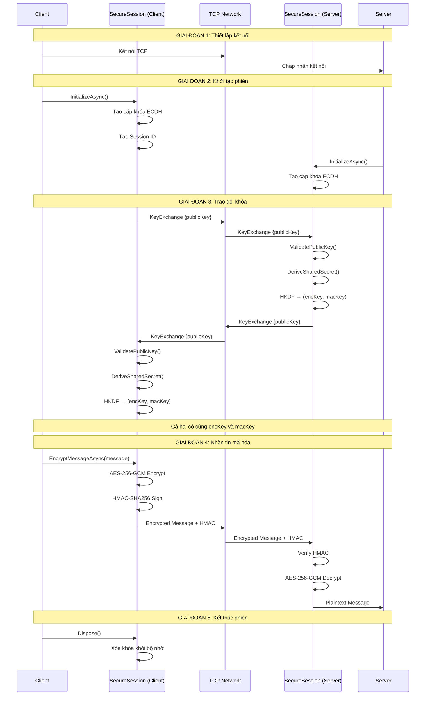
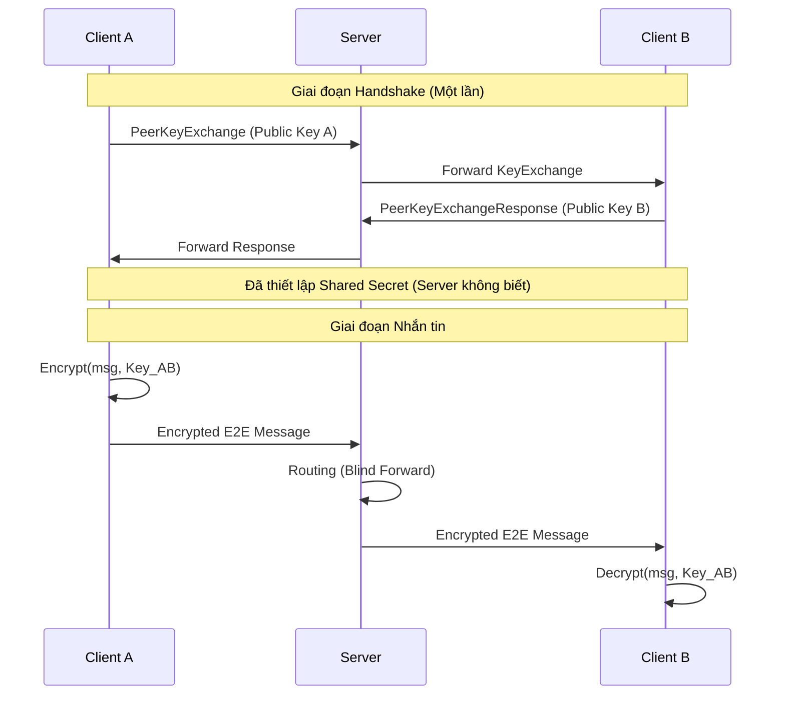
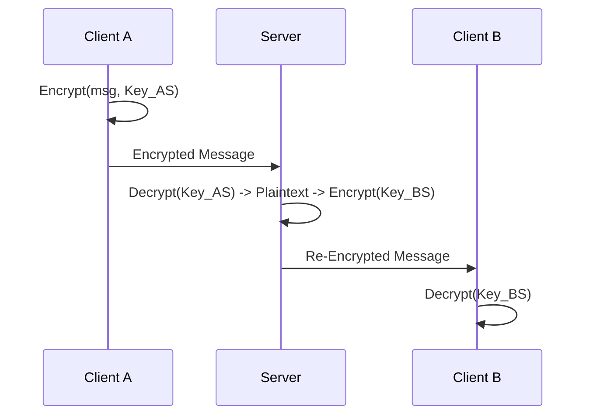
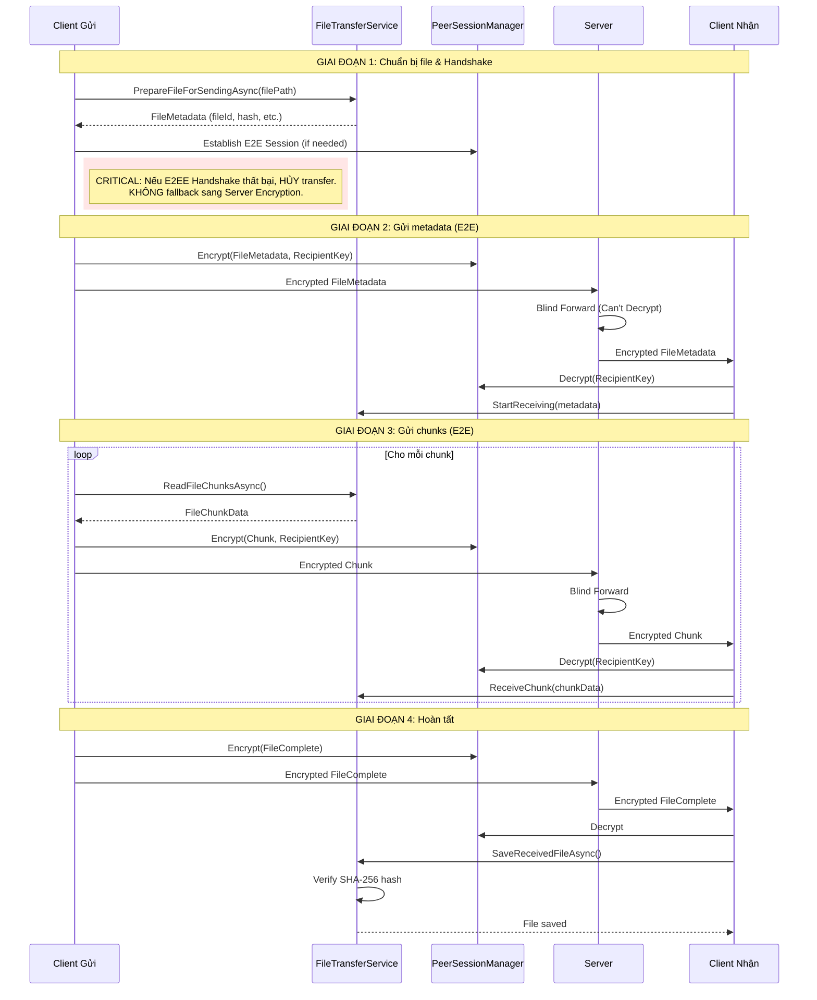
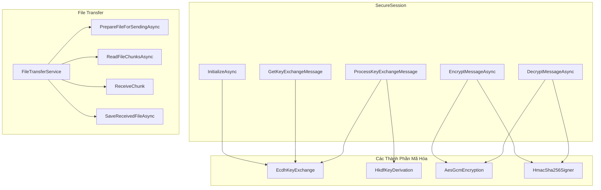
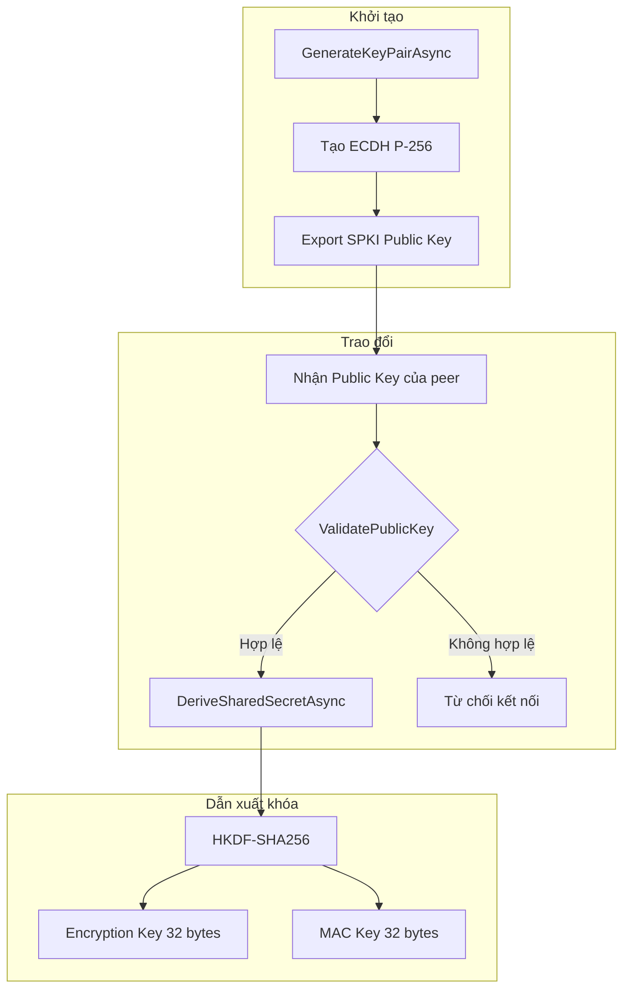
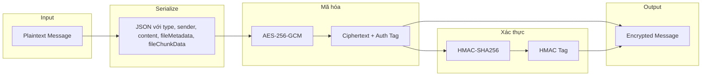
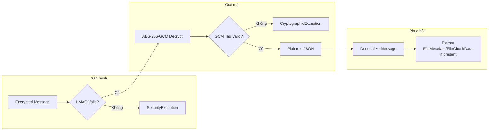
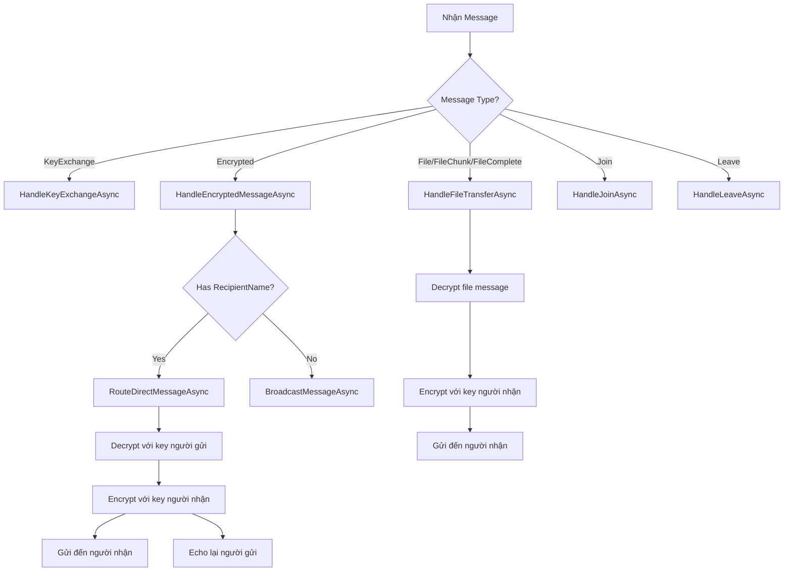

# Luồng Bảo Mật & Hạn Chế SecureChat

**Phiên bản**: 2.0  
**Trạng thái**: Đã triển khai  
**Cập nhật lần cuối**: 27/01/2026

---

## Tổng Quan

Tài liệu này mô tả luồng bảo mật end-to-end của SecureChat-System, cách các thành phần tương tác, và các hạn chế bảo mật đã biết.

```
┌─────────────────────────────────────────────────────────────────────────────┐
│                     Luồng Bảo Mật SecureChat (Hybrid)                        │
├─────────────────────────────────────────────────────────────────────────────┤
│  1. Kết nối TCP  →  2. Trao đổi khóa  →  3. Hybrid Message Routing          │
│                        ECDH P-256         (Ưu tiên E2E, Fallback Relay)     │
├─────────────────────────────────────────────────────────────────────────────┤
│  SecureSession điều phối: ECDH + HKDF + AES-256-GCM + HMAC-SHA256           │
└─────────────────────────────────────────────────────────────────────────────┘
```

---

## Bộ Não Bảo Mật (The Security Brain)

Để hiểu rõ cách hệ thống xử lý bảo mật, hãy hình dung "bộ não" này gồm 2 bán cầu chính: **Trao Đổi (Exchange)** và **Dẫn Xuất (Derivation)**.

### 1. Phân Biệt ECDH và HKDF

| Thành Phần | File Code | Loại Hình | Vai Trò Thực Sự |
|------------|-----------|-----------|-----------------|
| **ECDH** | `EcdhKeyExchange.cs` | **Trao đổi qua mạng** | Phối hợp giữa 2 bên để tạo ra một bí mật chung (Shared Secret). Cần gửi Public Key qua mạng. |
| **HKDF** | `HkdfKeyDerivation.cs` | **Xử lý cục bộ** | Từ bí mật chung đó, "xay" ra các chìa khóa cụ thể để sử dụng. Không bao giờ gửi qua mạng. |

#### Mô Hình Tư Duy Đúng (Correct Mental Model)

```
┌─────────────────────────────────────────────────────────────────────────┐
│              SỰ PHỐI HỢP GIỮA ECDH VÀ HKDF                              │
├─────────────────────────────────────────────────────────────────────────┤
│                                                                         │
│   Client A (Alice)                         Client B (Bob)               │
│   ────────────────                         ──────────────               │
│                                                                         │
│   1️⃣ ECDH (Trao đổi)                       1️⃣ ECDH (Trao đổi)            │
│   • Tạo Private/Public Key                 • Tạo Private/Public Key     │
│   • Gửi Public Key A ──────────>           • Nhận Public Key A          │
│   • Nhận Public Key B <──────────          • Gửi Public Key B           │
│          ↓                                        ↓                     │
│   ⚡ Shared Secret (Giống nhau) ⚡         ⚡ Shared Secret (Giống nhau) ⚡ │
│          ↓                                        ↓                     │
│                                                                         │
│   ════════════════════════════════════════════════════════════════════  │
│          🛑 Ranh giới mạng (Ngừng gửi dữ liệu bảo mật tại đây) 🛑         │
│   ════════════════════════════════════════════════════════════════════  │
│                                                                         │
│   2️⃣ HKDF (Dẫn xuất cục bộ)                2️⃣ HKDF (Dẫn xuất cục bộ)     │
│   • Input: Shared Secret                   • Input: Shared Secret       │
│   • Output:                                • Output:                    │
│     🔑 Encryption Key                        🔑 Encryption Key          │
│     🔖 MAC Key                               🔖 MAC Key                 │
│                                                                         │
└─────────────────────────────────────────────────────────────────────────┘
```

### 2. Vai Trò Của Các Loại Khóa (Defense in Depth)

Hệ thống sử dụng mô hình **Encrypt-then-MAC** để bảo vệ kép.

#### 🔑 Encryption Key (Khóa Mã Hóa) - Bảo Mật (Confidentiality)
*   **Mục đích**: Giấu nội dung tin nhắn.
*   **Cơ chế**: Dùng AES-256-GCM. Biến "Hello" thành `xc9f1...`.
*   **Ví dụ**: Giống như **Chiếc Chìa Khóa** két sắt. Chỉ người có chìa mới mở két đọc thư được.

#### 🔖 MAC Key (Khóa Xác Thực) - Toàn Vẹn (Integrity)
*   **Mục đích**: Đảm bảo tin nhắn chính chủ và không bị sửa đổi.
*   **Cơ chế**: Dùng HMAC-SHA256. Tạo chữ ký số trên dữ liệu đã mã hóa.
*   **Ví dụ**: Giống như **Con Dấu Niêm Phong** dán ngoài két sắt.
    *   Nếu niêm phong rách → Có kẻ gian đụng vào két.
    *   Nếu niêm phong lạ → Không phải két chính chủ gửi.

> [!TIP]
> **Quy trình nhận tin**: Kiểm tra **Niêm phong (MAC)** trước 🧐. Nếu xịn mới dùng **Chìa khóa (Encryption Key)** mở két 🔓.

---

## Mô Hình Bảo Mật Lai (Hybrid Security Model)

Hệ thống sử dụng cơ chế bảo mật lai thông minh, ưu tiên **True E2E** và tự động chuyển sang **Server Relay** nếu cần thiết.

### 1. Cơ Chế Ưu Tiên (Priority Logic)
Client sẽ luôn cố gắng thiết lập kênh bảo mật trực tiếp (E2E) trước.

```mermaid
flowchart TD
    A[Gửi Tin Nhắn Direct] --> B{Đã có E2E Session?}
    B -->|Có| C[Gửi qua kênh E2E]
    B -->|Chưa| D[Thử Key Exchange với Peer]
    
    D --> E{Thành công?}
    E -->|OK| F[Lưu Session] --> C
    E -->|Timeout (5s)| G[Fallback: Server Relay]
    
    C -->|Mã hóa với Key Peer| H[Server Blind Forward]
    G -->|Mã hóa với Key Server| I[Server Decrypt/Re-encrypt]
```

### 2. Hai Chế Độ Hoạt Động

#### ✅ Chế Độ 1: True E2E (Ưu Tiên)
*   **Kích hoạt**: Khi 2 client trao đổi key thành công.
*   **Bảo mật**: Server **KHÔNG THỂ** đọc tin nhắn (do không có Shared Secret của 2 client).
*   **Luồng**: `Client A (Encrypt E2E) --> Server (Blind Forward) --> Client B (Decrypt E2E)`

#### ⚠️ Chế Độ 2: Server Relay (Fallback)
*   **Kích hoạt**: Khi kết nối P2P thất bại hoặc timeout (5s).
*   **Bảo mật**: Server **CÓ THỂ** đọc tin nhắn (Server-in-the-Middle).
*   **Luồng**: `Client A (Encrypt Server) --> Server (Decrypt & Re-encrypt) --> Client B (Decrypt Server)`

> [!NOTE]
> Đoạn mô tả trong hình ảnh bạn đề cập ("Mô hình hiện tại: Server đóng vai trò relay...") chính là mô tả cho **Chế Độ 2 (Fallback)** khi E2E không khả dụng.

---

## Luồng Bảo Mật End-to-End

### Sơ Đồ Trình Tự Hoàn Chỉnh



---

## Luồng Tin Nhắn Trực Tiếp (Direct Message Flow)

### 1. Luồng E2E (Mặc định)



### 2. Luồng Fallback (Relay Mode)
*Tự động kích hoạt khi E2E handshake thất bại hoặc timeout.*



---

## Luồng File Transfer

### Sơ Đồ File Transfer (E2EE Enforced)



### Cấu Trúc File Transfer Messages

```
┌─────────────────────────────────────────────────────────────┐
│                     FileMetadata                             │
├─────────────────────────────────────────────────────────────┤
│  fileId: "unique-guid"                                      │
│  fileName: "document.pdf"                                   │
│  fileSize: 54930 (bytes)                                    │
│  totalChunks: 1                                             │
│  fileHash: "Base64(SHA-256)"                                │
│  contentType: "application/pdf"                             │
└─────────────────────────────────────────────────────────────┘

┌─────────────────────────────────────────────────────────────┐
│                     FileChunkData                            │
├─────────────────────────────────────────────────────────────┤
│  fileId: "same-guid-as-metadata"                            │
│  chunkIndex: 0 (0-based)                                    │
│  data: "Base64(chunk data up to 64KB)"                      │
│  totalChunks: 1                                             │
└─────────────────────────────────────────────────────────────┘
```

### Giới Hạn File Transfer

| Thuộc tính | Giá trị | Ghi chú |
|------------|---------|---------|
| Chunk Size | 64 KB | Mỗi chunk tối đa 65,536 bytes |
| Max Message Size | 512 KB | Bao gồm JSON + encryption overhead |
| Max Content Length | 500,000 chars | Hỗ trợ Base64 chunks + encryption |
| File Save Location | ~/Downloads | Tự động lưu vào thư mục Downloads |

---

## Tương Tác Giữa Các Thành Phần

### Sơ Đồ Thành Phần



### Vai Trò Từng Thành Phần

| Thành Phần | File | Vai Trò |
|------------|------|---------|
| **SecureSession** | [SecureSession.cs](file:///Users/quocvinhtrinhlam/Desktop/SecureChat-System/src/SecureChat.Core/Security/Implementations/SecureSession.cs) | Điều phối toàn bộ quy trình mã hóa |
| **EcdhKeyExchange** | [EcdhKeyExchange.cs](file:///Users/quocvinhtrinhlam/Desktop/SecureChat-System/src/SecureChat.Core/Security/Implementations/EcdhKeyExchange.cs) | Trao đổi khóa ECDH P-256 |
| **HkdfKeyDerivation** | [HkdfKeyDerivation.cs](file:///Users/quocvinhtrinhlam/Desktop/SecureChat-System/src/SecureChat.Core/Security/Implementations/HkdfKeyDerivation.cs) | Dẫn xuất khóa từ shared secret |
| **AesGcmEncryption** | [AesGcmEncryption.cs](file:///Users/quocvinhtrinhlam/Desktop/SecureChat-System/src/SecureChat.Core/Security/Implementations/AesGcmEncryption.cs) | Mã hóa AES-256-GCM |
| **HmacSha256Signer** | [HmacSha256Signer.cs](file:///Users/quocvinhtrinhlam/Desktop/SecureChat-System/src/SecureChat.Core/Security/Implementations/HmacSha256Signer.cs) | Xác thực toàn vẹn HMAC |
| **FileTransferService** | [FileTransferService.cs](file:///Users/quocvinhtrinhlam/Desktop/SecureChat-System/src/SecureChat.Core/Services/FileTransferService.cs) | Xử lý gửi/nhận file |
| **JsonMessageSerializer** | [JsonMessageSerializer.cs](file:///Users/quocvinhtrinhlam/Desktop/SecureChat-System/src/SecureChat.Core/Networking/JsonMessageSerializer.cs) | Serialize/deserialize messages |

---

## Chi Tiết Các Luồng

### 1. Luồng Trao Đổi Khóa



**Các bước xác thực khóa**:
1. Kiểm tra Base64 hợp lệ
2. Import thành công dưới dạng SPKI
3. Xác minh đường cong P-256
4. Kiểm tra tất cả bytes được sử dụng

### 2. Luồng Mã Hóa Tin Nhắn (Encrypt-then-MAC)



**Cấu trúc tin nhắn mã hóa**:
```
┌─────────────────────────────────────────────────────────────┐
│                    Encrypted Message                         │
├─────────────────────────────────────────────────────────────┤
│  type: "Encrypted"                                          │
│  senderId: sender UUID                                      │
│  senderName: "Vinh"                                         │
│  recipientName: "Hoang" (optional)                          │
│  content: Base64(ciphertext)                                │
├─────────────────────────────────────────────────────────────┤
│  securityMetadata:                                          │
│    ├── algorithm: "AES-256-GCM"                             │
│    ├── iv: Base64(nonce 12 bytes)                           │
│    ├── signature: Base64(GCM auth tag 16 bytes)             │
│    ├── hmac: Base64(HMAC-SHA256 32 bytes)                   │
│    └── keyId: session identifier                            │
└─────────────────────────────────────────────────────────────┘
```

### 3. Luồng Giải Mã Tin Nhắn (Verify-then-Decrypt)



> [!IMPORTANT]
> **HMAC được xác minh TRƯỚC khi giải mã** để ngăn chặn các tấn công oracle và đảm bảo tin nhắn không bị giả mạo.

---

## Server Message Handling

### Các Loại Message và Xử Lý



---

## Các Hạn Chế Đã Biết

### Bảng Tóm Tắt

| Hạn chế | Mức độ | Mô tả |
|---------|--------|-------|
| Server có thể đọc tin nhắn | Cao | Server làm relay, giải mã và mã hóa lại |
| Không có xác thực lẫn nhau | Cao | TOFU (Trust On First Use) |
| Không có key rotation | Trung bình | Khóa cố định trong suốt phiên |
| Không có session resumption | Thấp | Phải trao đổi khóa mới mỗi lần kết nối |
| Không có PKI | Cao | Không có certificate authority |

### Chi Tiết Hạn Chế

#### 1. Server Có Thể Đọc Tin Nhắn (Server-Relayed Model)

```
┌─────────────────────────────────────────────────────────────────────────────┐
│  Trạng thái: CHỈ xảy ra ở chế độ Fallback (Text Only)                       │
├─────────────────────────────────────────────────────────────────────────────┤
│                                                                             │
│  Client A ──(enc)──> Server ──(enc)──> Client B                             │
│                        ↓                                                    │
│                   [Đọc được plaintext]                                      │
│                                                                             │
│  • Xảy ra khi: E2E Handshake Timeout (Chỉ Text Message)                     │
│  • Server phải giải mã để re-encrypt cho đích                               │
│  • LƯU Ý: File Transfer sẽ THẤT BẠI nếu E2E lỗi (không fallback)            │
│                                                                             │
└─────────────────────────────────────────────────────────────────────────────┘
```

> [!WARNING]
> Trong chế độ **True E2E** (mặc định cho tin nhắn văn bản), Server **KHÔNG THỂ** đọc nội dung tin nhắn. Hạn chế này chỉ áp dụng cho chế độ Fallback và File Transfer.

#### 2. Không Có Xác Thực Lẫn Nhau (TOFU Model)

- Client không xác minh danh tính Server
- Server không xác minh danh tính Client
- Dễ bị tấn công MITM trong lần kết nối đầu tiên

#### 3. Không Có Key Rotation

- Khóa phiên (`encryptionKey`, `macKey`) được tạo một lần
- Nếu khóa bị lộ, tất cả tin nhắn trong phiên đó có thể bị giải mã

#### 4. (ĐÃ GIẢI QUYẾT) File Transfer Đã Có E2E

- File chunks được mã hóa E2E bằng Peer Key
- Server CHỈ forward mù (blind forward), không thể đọc nội dung file
- Yêu cầu bắt buộc phải thiết lập được E2E Session để gửi file

---

## Các Vector Tấn Công & Biện Pháp

### Bảng Tổng Quan

| Tấn công | Trạng thái | Biện pháp |
|----------|------------|-----------|
| Man-in-the-Middle (Server) | **Đã bảo vệ** (E2E Mode) | Server không thể giải mã trong chế độ E2E |
| Man-in-the-Middle (Network) | Đã bảo vệ | TLS-like encryption |
| Replay Attack | Đã xử lý | Message ID + Timestamp |
| Timing Attack | Đã xử lý | FixedTimeEquals |
| Invalid Curve Attack | Đã xử lý | Public key validation |
| Tampering | Đã xử lý | AES-GCM + HMAC |
| Large Message DoS | Đã xử lý | MaxContentLength = 500,000 |

### Chi Tiết Biện Pháp

#### 1. Chống Tấn Công Timing

```csharp
// SecureChat sử dụng so sánh thời gian hằng số
CryptographicOperations.FixedTimeEquals(computedHmac, expectedHmac);
```

#### 2. Chống Invalid Curve Attack

```csharp
// Xác minh khóa nằm trên đường cong P-256
if (parameters.Curve.Oid?.Value != ECCurve.NamedCurves.nistP256.Oid.Value)
{
    return false; // Từ chối khóa không hợp lệ
}
```

#### 3. Chống Replay Attack

- **Message ID**: Mỗi tin nhắn có UUID duy nhất
- **Timestamp**: Xác minh tin nhắn trong khoảng ±5 phút
- **Session ID**: Khóa chỉ hợp lệ trong phiên hiện tại

#### 4. Bảo Vệ Toàn Vẹn Kép

SecureChat sử dụng cả:
- **AES-GCM Authentication Tag**: Bảo vệ tầng trong
- **HMAC-SHA256**: Bảo vệ tầng ngoài (Encrypt-then-MAC)

#### 5. Giới Hạn Kích Thước Tin Nhắn

```csharp
// Ngăn chặn DoS bằng tin nhắn lớn
public const int MaxMessageSize = 512 * 1024; // 512 KB
const int MaxContentLength = 500_000; // Characters
```

---

## Khuyến Nghị Cải Tiến

### Ưu Tiên Cao

| Cải tiến | Mô tả |
|----------|-------|
| **File Encryption E2E** | ✅ Đã triển khai (Strict Mode: No Fallback) |
| **Mutual Authentication** | Thêm xác thực lẫn nhau bằng certificate hoặc pre-shared key |
| **Key Rotation** | Triển khai rekeying định kỳ hoặc sau N tin nhắn |

### Ưu Tiên Trung Bình

| Cải tiến | Mô tả |
|----------|-------|
| **Double Ratchet** | Áp dụng Signal Protocol cho PFS ở mức tin nhắn |
| **Message Deduplication** | Theo dõi Message ID để chống replay |

### Ưu Tiên Thấp

| Cải tiến | Mô tả |
|----------|-------|
| **Session Resumption** | Cho phép resume session đã thiết lập |
| **Post-Quantum Crypto** | Chuẩn bị cho kỷ nguyên quantum computing |

---

## Xem Thêm

- [ARCHITECTURE.md](file:///Users/quocvinhtrinhlam/Desktop/SecureChat-System/docs/ARCHITECTURE.md) - Tổng quan kiến trúc
- [CRYPTOGRAPHY.md](file:///Users/quocvinhtrinhlam/Desktop/SecureChat-System/docs/CRYPTOGRAPHY.md) - Đặc tả thuật toán
- [MESSAGE_PROTOCOL.md](file:///Users/quocvinhtrinhlam/Desktop/SecureChat-System/docs/MESSAGE_PROTOCOL.md) - Giao thức tin nhắn
- [CODE_EXPLANATION.md](file:///Users/quocvinhtrinhlam/Desktop/SecureChat-System/docs/CODE_EXPLANATION.md) - Giải thích chi tiết code
